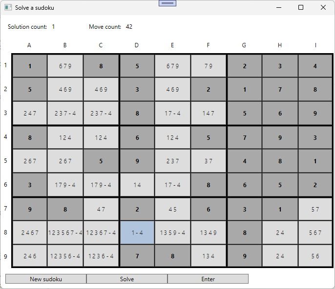
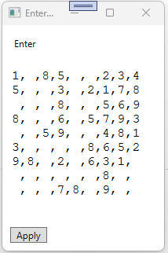

# Solve a sudoku

## Lehrziele

- Wpf XAML Layouts, Styles
- Wpf XAML UserControl mit DependencyProperties
- Wpf Mvvm: `BaseViewModel`, `NotifyPropertyChanged`, `RelayCommand`, `WindowNavigator`
- Wpf XAML Erstellen der Controls im Code Behind
- Wpf mit:
  - `DependencyInjection` 
  - `HttpRequest` Die Daten kommen von einem Service (Azure)

## Aufgabenstellung

Erstellen sie eine WPF Anwendung zum Lösen eines Sudokus. Die Berechnungen werden von einem Cloud Dienst übernomen, das Ergebnis (der nächste mögliche Schritt) wird in der Wpf Anwendung visualisiert.

### MainWindow



#### Daten

Das aktuelle Sudoku ( = `IEnumerable<string>`) wird angezeigt
* Anzahl der möglichen Lösungen: *Solution count* - bestimmt durch den Cloud Service.
* Anzahl der bereits ausgefüllten Zellen: *MoveCount*
* Jede Zelle des Sudokus  
  * Die Zahl - wenn bereits eingegeben  
  * Die noch möglichen Zahlen dieses Feldes - bestimmt durch den Cloud Service  
  
#### Buttons

Die Buttons sind mit folgenden Funktionen belegt:

| Button                          | Funktion                                                                                                                                                                                                                                                                                                                                                                                                                                                                                                                                                                                                        | Ausführbar                                      |
| ------------------------------- | --------------------------------------------------------------------------------------------------------------------------------------------------------------------------------------------------------------------------------------------------------------------------------------------------------------------------------------------------------------------------------------------------------------------------------------------------------------------------------------------------------------------------------------------------------------------------------------------------------------- | ----------------------------------------------- |
| New sudoku | Anlegen eines neuen Sudokus - das aktuelle wird überschrieben. | immer |  
| Solve | Der Cloud Service wird aufgerufen um eine mögliche Lösung zu finden und anzuzeigen. Verwenden Sie den Endpoint api/sudoku/finish| immer |  
| Enter | Startet ein neues Fenster zum Eingeben eines Sudokus. Siehe *EnterSudoku* Fenster.| Immer |
| Feld (Sudoku-Zelle) | Jeder der 81 Zellen kann gedrückt werden (UserControl als Button).  Beim Drücken wird der Cloud Service aufgerufen (Endpoint:api/sudoku/next). Dieser berechnet für die Zelle das nächste mögliche Ergebnis.| nur wenn keine Berechnung läuft.|

#### Sudoku Zelle

Durch den Cloud Service (Endpoint: api/sudoku) wird für jede Zelle bestimmt (=Rückgabewert):
* *No*  
  Die Zahl, wenn festgelegt
* *AllPossibles*  
  Alle möglichen Zahlen (wenn *No* nicht festgelegt).
* *Possible*  
  Untermenge von *AllPossibles*. Hier werden jedoch Zahlen ausgeschlossen, die durch weitere Regeln nicht mehr sinnvoll eingetragen werden können. 
* *NotPossibleExplanation*  
  Eine Liste von Erklärungen, warum Zahlen ausgeschlossen werden. Zeigen Sie diese Liste als ToolTip an.

Zeigen Sie die Zellen nach folgenen Kriterien an:
* Eine Zahl (*No*) ist in der Zelle vorhanden.  
  *Fett, Dunktegrau*  
* Es ist noch keine *No* gesetzt und es gibt mehrere mögliche Zahlen.  
  *FontWeight = Thin*
* Die Zelle ist eindeutig lösbar - es gibt nur eine mögliche Zahl.  
  *LightSteelBlue und FontWeight = Thin*
  
Hinweis: 1 7 9 - 4 bedeutet: 1,4,7 und 9 ist theoretisch möglich, 4 wird aber ausgeschlossen. 

### EnterSudoku 



#### Daten

Mit dem Dialog kann ein Sudoku bearbeitet werden.
Die Daten des Sudokus ( = `IEnumerable<string>` ) werden in eine TextBox geladen und beim Verlassen des Dialogs durch *Apply* wieder in die Liste übernommen.

#### Buttons

Die Buttons sind mit folgenden Funktionen belegt:

| Button                          | Funktion                                                                                                                                                                                                                                                                                                                                                                                                                                                                                                                                                                                                        | Ausführbar                                      |
| ------------------------------- | --------------------------------------------------------------------------------------------------------------------------------------------------------------------------------------------------------------------------------------------------------------------------------------------------------------------------------------------------------------------------------------------------------------------------------------------------------------------------------------------------------------------------------------------------------------------------------------------------------------- | ----------------------------------------------- |
| Apply | Übernimmt das Sudoku und schließt den Dialog.| immer |  


### CloudService

Verwenden Sie einen der folgenden Services (bevorzugt: Azure)

* https://sudokusolve.azurewebsites.net/  
* https://student.cloud.htl-leonding.ac.at/h.aitenbichler/sudokusolveserver/

Für diese Beispiel werden nur einige Entpoints verwendet:

* /api/sudoku  
  * Eingangsparameter: Sudoku als List<string> (jede Zeile des Sudokus)  
  * Rückgabewert:
```
public class SudokuSolveResult
{
    public IEnumerable<SudokuSolveField> Field { get; set; } = new List<SudokuSolveField>();
}
public class SudokuSolveField
{
    public int Row { get; set; }
    public int Col { get; set; }

    public int? No { get; set; }

    public ICollection<int>?    AllPossible            { get; set; }
    public ICollection<int>?    Possible               { get; set; }
    public ICollection<string>? NotPossibleExplanation { get; set; }
}

```

* /api/sudoku/next  

* /api/sudoku/finish  

Die Swagger-Seite (https://sudokusolve.azurewebsites.net/swagger) zeigt Ihnen die Definition der Api.