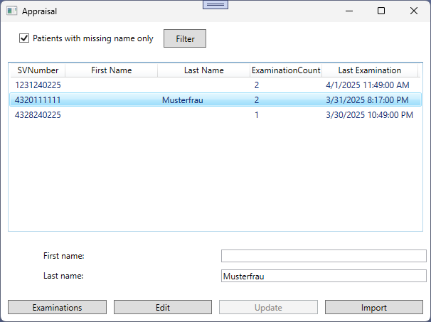

# Appraisal

## Lehrziele

- App Struktur mit `Core` und `Persistence`  
- Wpf Mvvm: `BaseViewModel`, `NotifyPropertyChanged`, `RelayCommand`, `WindowNavigator`
- Wpf Custom Draw
- WebAPI
- AngularUI

## Aufgabenstellung

Es soll ein medizinisches Befundsystem entwickelt werden, welches Untersuchungsdaten von einem Fremdsystem importiert, in einer Datenbank speichert und für eine Begutachtung aufbereitet.  
Fehlende Daten - der Name des Patienten ist in den Importdaten nicht angegeben - sollen ergänzt werden können.

In einer Web Anwendung können Ärzte eine Begutachtung durchführen und das Ergebnis im System erfassen.

## Task 1 - Datenstruktur

Für das neue System wurde das folgende Datenmodell erstellt.


* *Patient*  
  Alle Patienten werden hier gespeichert.  
  Die SVNummer ist identifizierend und muss beim Erstellen angegeben werden.  
  Die nicht angegebenen Werte (z.B. Vor- und Nachname werden durch die WPF Anwendung ergänzt).

* *Doctor*  
  Ärzte, die eine Untersuchung durchführen oder einen Befund erstellen werden hier gespeichert.  

* *Examination*  
  Das Entity 'Examination' (=Untersuchung) speichert eine Untersuchung.  
  Z.B. wird bei einem EKG (Elektrokardiogramm) ein Entity angelegt, welches das Datum(+Urzeit), den Patienten und die Aufzeichnung der Hertztöne (ExaminationDataStream) enthält.
  Ein Arzt analysiert diese Daten und schreibt einen Befund (=MidicalFindings, =MidicalFindingsDate).

* *ExaminationDataStream*  
  Eine Untersuchung kann mehrere Datenquellen haben. Bei einem EKG werden mehrere Sensoren auf den Körper geklebt, die jeweils eine eigene DatenQuelle (=ExaminationDataStream) erzeugen.

  * *Name*  
    Name des Streams, z.B. welcher Sensor hat den Stream erzeugt.

  * *Period*  
    Zykluszeit ("Abtastrate") der Datenreihe.  
    Ist die Zeit, die zwischen zwei Messwerten vergeht.

  * *Values*  
    Eine Zeichenkette, die alle (Mess-)Werte - durch Beistrich getrennt - enthält.  
    Beispiel: `0,-0.1,0.2`  
    Hinweis: Verwenden Sie `CultureInfo.InvariantCulture` um den Punkt als Dezimaltrennung anzugeben.

  * *MyValues*  
    Gerechnetes Property, welches die Werte (=Values) als `IList<double>` liefert.

Folgende Punkte sind umzusetzen:

* Machen sie sich mit dieser Datenstruktur vertraut.  
  
## Task 2 - Import

Ein Fremdsystem - z.B. ein EKG Gerät - stellt seine Untersuchungsdaten in Dateien bereit. Diese Dateien haben folgenden Aufbau:

```
Key;Value
Patient;1230290204
PatientName;Mustermann Max
Date;2025.03.30 20:49
DataStreams;LeadI,LeadII
LeadIName;Left
LeadIPeriod;0.1
LeadIData;0,0,0,0.1,0.2,0,0.25,0.3,0.4,0.3,0.1,0
LeadIIName;Right
LeadIIPeriod;0.2
LeadIIData00001;0
LeadIIData00002;0.2
LeadIIData00003;0.4
LeadIIData00004;0.3
LeadIIData00005;0.1
LeadIIData00006;0
```

* Die erste Zeile ist immer `Key;Value`  
* Der Rest der Datei kann beliebig sortiert sein. Der Text `Patient;1230290204` kann in einer beliebigen Zeile stehen.  
* Der gesamte Inhalt kann als `Dictionary` betrachtet werden.

Berücksichtigen Sie die folgenden Einträge:

* `Patient`  
  Mandatory, spezifiziert den Patienten. Der Wert (=value) muss eine gültige SV-Nummer sein.  
  Dateien mit einer falschen SV-Nummer dürfen nicht importiert werden.  

  Über die in der Importdatei angegebenen SVNummer wird der Patient in der Datenbank gesucht. 
  Kann dieser nicht gefunden werden, wir ein neuer Patient angelegt.

* `PatientName`  
  Optional, Nachname und optionaler Vorname (in dieser Reihenfolge) des Patienten.  
  Beispiel: '*Mustermann*' => Nachname => Mustermann, Vorname => leer (null)  
  Beispiel: '*Mustermann Max*' => Nachname => Mustermann, Vorname => Max  

* `Date`  
  Mandatory, Datum der Untersuchung  
  Format : **yyyy.MM.dd HH:mm**
  
* `DataStreams`  
  Mandatory, durch Beistrich getrennte Namen (Prefix) der Datenreihen.  
  Beispiel: **LeadI** => Es gibt nur einen Stream mit dem Namen **LeadI**  
  Beispiel: **LeadI,LeadII** => Es gibt zwei Stream mit den Namen (Prefix) **LeadI** und  **LeadII**

* `{Stream-Prefix}Name`  
  Mandatory, Name des Stream (string), Beispiel: '**Lead I**'

* `{Stream-Prefix}Period`  
  Mandatory, Zykluszeit des Stream (double, CultureInfo.InvariantCulture), Beispiel: '**0.2**'

* `{Stream-Prefix}Data{Postfix}`  
  Mindestens ein Eintrag, (Mess-)Werte des Stream (double, CultureInfo.InvariantCulture) durch ',' oder ' ' (blank) getrennt.  
  Beispiel: '**0.2,0,-0.1**'
  
  Existieren mehrere Einträge die mit `{Stream-Prefix}Data` beginnen, werden diese nach dem `Postfix` sortiert und als eine Reihe betrachtet (linq: StartWith, OrderBy, SelectMany).

  Beispiel:

    `LeadIIData00001;0,0.1`   => Postfix=00001, zwei Werte  
    `LeadIIData00002;0.2` => Postfix=00002, ein Wert  

  ergibt eine Datenreihe von `0,0.1,0.2`

**Achtung**

Untersuchungen werden nur EINMAL importiert.
Prüfen Sie beim Import, ob eine Untersuchung schon übernommen wurde. Die identifizierenden Merkmale sind *Patient* (SVNummer) und *Untersuchungsdatum*.

### Umsetzungsrichtlinien

Als Umsetzungsrichtlinien gelten:  

* Pro Datei ist eine Transaktion vorzusehen.  
* Es müssen die Navigation-Properties verwendet werden.  
* Unnötige Aufrufe von **Add**, **AddRange** (im Repository) sind nicht erlaubt.
* Die Spalte **Id** hat beim Import keinen (sinnvollen) Wert und ist daher nicht zu verwenden.  

## Task 3 - WPF

Die Verwaltung der Patienten und der Untersuchungen soll in einer WPF Anwendung umgesetzt werden.  

Es sollen folgende Use-Cases unterstützt werden.

### Übersicht aller Patienten  



* Die Checkbox steuert, welche Patienten angezeigt werden sollen.  
  Ist sie selektiert, werden nur Patienten geladen, bei denen entweder der Vornamen und/oder der Nachname fehlt. Andernfalls werden **alle** Patienten geladen.    
* Nur beim Drücken der Schaltflächen "Filter" wird die Liste neu aufgebaut. Das Ändern der Checkbox löst noch kein "Neuladen" aus.   
* Sortieren wird die Liste nach **SV-Nummer** aufsteigend.
* Die Liste zeigt die Patienten an. Achten Sie auf die Spalten *ExaminationCount*.  
  Hier wird die Anzahl der Untersuchungen (=Examination) angezeigt.  
* Die Spalten *Last Examination* enthält das Datum der spätesten (=neuesten) Untersuchung.  
* Mit dem Button "Details" wird ein neues Fester geöffnet, welches die Untersuchung grafisch anzeigt.  
  Bitte beachten Sie: der Button ist nur aktiv, wenn ein Patient ausgewählt (selektiert) wurde.
* Mit den Buttons "Edit" (Freischalten der Änderung) und "Update" (Übernehmen der Änderung) kann der Werte für *First name* und *Last name* (Achtung: Nullable) verändert werden.  
  Achten Sie darauf, dass die Buttons richtig aktiviert werden und die Änderungen nur so gespeichert werden.  
  Hinweis: ReadOnly für die Felder wenn nicht aktiv.
* Mit dem Button "Import" wird der Importvorgang gestartet.  
  Geben Sie mit einer Messagebox aus, wie viel Untersuchungen importiert werden konnten. 
  Im Gegensatz zur ImportConsole verwenden Sie hier das Verzeichnis "DataImport/WPF".  
  Bitte beachten Sie: der Button ist immer aktiv.  
  Bitte beachten Sie: Durch den Import können sich die Patientendaten geändert haben.    

Als Umsetzungsrichtlinien gelten:  

* Das Filtern der Daten (z.B. durch die Checkbox) erledigt die Datenbank.  
* Das Dto wird im Repository angelegt - und nicht im ViewModel.  
* Das Laden der gesamten Datenbank in den Hauptspeicher ist nicht zulässig.  
* Achten Sie auf eine saubere MVVM Umsetzung.  

### Vorschau Untersuchungen   

Der Dialog dient zur Kontrolle, ob die Daten vom Fremdsystem korrekt übernommen wurden.  


* Im oberen Bereich werden die Patientendaten (nur lesend) angezeigt.  
* Eine Liste (DataGrid) enthält alle Untersuchungen dieses Patienten.  
* Bei einer korrekten Selektion der Untersuchung (DataGrid) werden alle ExaminationDataStreams im unteren Teil des Dialogs angezeigt.
* Der Button "Close" schließt den Dialog - er ist immer aktiv.

Als Umsetzungsrichtlinien gelten:  

* Beim Öffnen des Dialog werden die Daten von der Datenbank geladen.    
* Die unterschiedlichen Datenstreams müssen nicht auf die gleiche Zeit skaliert werden.   
  Jeder Datenstream verwendet die volle Breite.    
* Alle DataStreams werden mit einem Control gezeichnet. Sind mehrere Streams enthalten, müssen die Streamgrößen (Höhen) angepasst werden.  

## Task 4 - Angular

### Übersicht Untersuchungen  


* Beim Aufrufen von Angular wird automatisch auf die Übersichtsseite gewechselt.  
* Über die NavBar kann ebenfalls diese Seite aufgerufen werden (Eintrag: Examination Overview)  
* Die Seite zeigt standardmäßig nur die noch zu begutachtenden Untersuchungen an.  
  Der Benutzer kann aber mit der Checkbox "Show all examinations" die bereits abgeschlossenen Untersuchungen anzeigen lassen.  
* Sortieren Sie die List nach dem Untersuchungsdatum (aufsteigend, älteste zuerst).  
* Beim Ändern der Checkbox sind die Daten vom WebAPI neu zu laden!    
* Mit den Button "Add findings" (noch keine Befundung) bzw. "Update findings" (es existiert bereits ein Befund) spring das Programm zur Eingabeseite eines Befunds.  
  
### Befund

Wegen der großen Datenmenge (eine Messwertreihe hat einige tausend Werte) dauert das Laden einige Zeit.  
Zeigen Sie in dieser Zeit einen **Border spinner** an!


```
  <div class="spinner-border" role="status">
    <span class="sr-only"></span>
  </div>
```

Konnten die Daten geladen werden (WebAPI) wird die Seite wie folgt angezeigt:


* Im oberen Bereich der Seite werden die Daten der Untersuchung angeführt.
* Im mittleren Teil werden (alle) Datenstreams gezeichnet.  
  Verwenden sie dafür die Komponente `examination-data-stream`  
* Unten gibt der Arzt seinen Befund (=Midical findings) in einem `<textarea>` ein.  
  Für das Speichern darf der Befund nicht leer sein!  Siehe unten  
  p.s.: In unserem Fall war der Arzt **chatgpt**  


