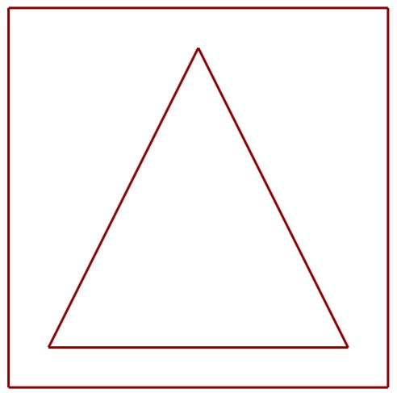
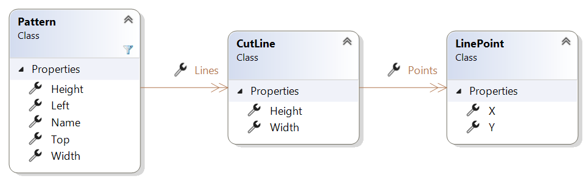
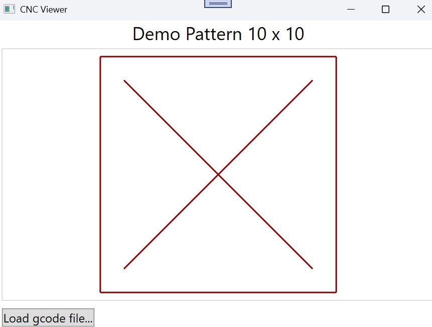
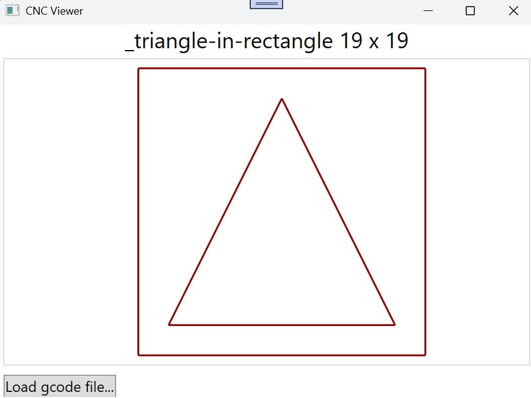
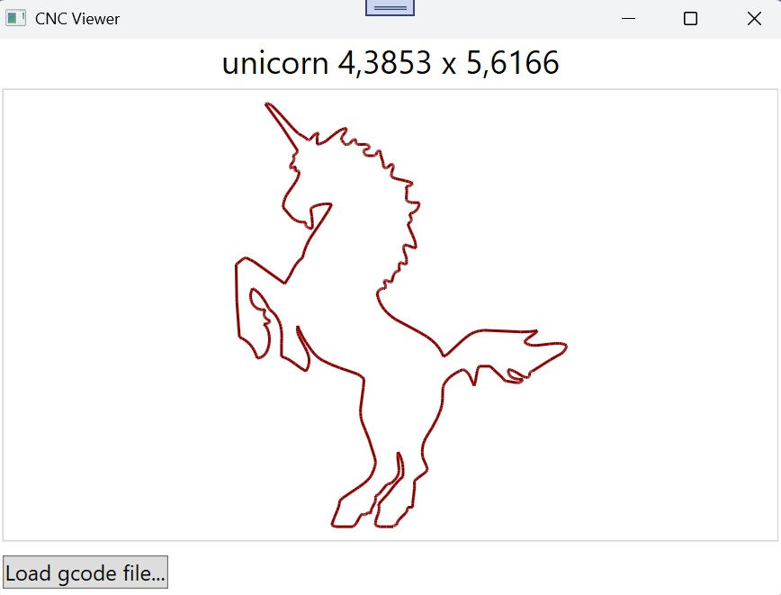
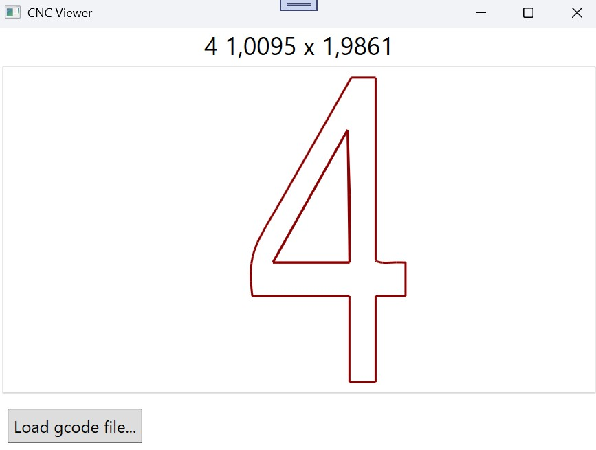

# CNC Viewer

## Lehrinhalte

- Parsen von 2D-Figuren aus `gcode`-Dateien
- WPF `UserControl`, MVVM + Databinding

## GCode

Das `gcode`-Format beschreibt die Syntax von Steuerbefehlen von CNC-Maschinen, um graphische Modelle auszuschneiden. In diesem Übungsbeispiel befassen wir uns mit einer vereinfachten Variante und üben das Auslesen und Visualisieren von mit `gcode` beschriebenen 2D-Figuren.

### `gcode` Definition

Jede Zeile einer `gcode`-Textdatei besteht aus

- einem 3-stelligen Operationscode:
  - `G00` (**Up**): Bewege das Schneidgerät zu einer Koordinate, ohne zu schneiden (Schneider ist in der Luft)
  - `G01` (**Down**): Bewege das Schneidgerät zu einer Koordinate und schneide dabei (Schneider sitzt am Material)
- gefolgt von
  - entweder einem Z-Wert, z.b. `Z0.000`, der die gewünschte Position des Schneidgeräts auf der Z-Achse angibt
  - oder einem X/Y-Koordinationpaar, z.B. `X1.0042 Y2.1534`, das die gewünschte (X/Y)-Position des Schneidgeräts angibt

### `gcode` Beispiel

Das folgende Beispiel - siehe auch `gcode-files/_triangle-in-rectangle.nc` - ergibt zwei getrennte Schnittlinien:

- Ein Rechteck mit Breite `19` und Höhe `19`
- Ein Dreieck zwischen `3/3`, `10.5/18`, `18/3`

Zwischen den beiden Linien wird der Schneidkopf mit `G00` hochgehoben, mit `G00` zum Start der nächsten Linie bewegt und dort wieder mit `G01` auf das Material gesetzt.

```gcode
G00 Z0.0000            ; start at safe home position
G00 X1.0000 Y1.0000    ; move to 1/1
G01 Z4.7484            ; push down the cutter
G01 X20.0000 Y1.0000   ; move while cutting to 20/1
G01 X20.0000 Y20.0000
G01 X1.0000 Y20.0000
G01 X1.0000 Y1.0000
G00 Z0.0000             ; pull up the cutter
G00 X3.0000 Y3.0000     ; move to 3/3
G01 Z4.7484             ; push down the cutter
G01 X18.0000 Y3.0000    ; move while cutting to 18/3
G01 X10.5000 Y18.0000
G01 X3.0000 Y3.0000
G00 Z0.0000             ; pull up the cutter
```

Dieses Muster in einer 2D-Vorschau gerendert könnte so aussehen:



## Aufgabenstellung

Ihre Aufgabe ist das Entwickeln einer einfachen Desktop-Anwendung, die eine `gcode`-Datei einlesen kann und die in dieser Datei enthaltene Schnittfigur als Vorschau rendert.

### Datenmodell

Das Datenmodell ist bereits im `Core` Projekt vorgegeben:



### Beispiel: Demo-Pattern

- Bei Default wird ein hard-codiertes Demo-Pattern gerendert (siehe `Core/Entities/Pattern.Demo.cs`):

  ```cs
  public static Pattern Demo = new Pattern
  {
    Name = "Demo Pattern",
    Lines = [
      new CutLine
      {
        Points = [
          new LinePoint { X = 0, Y = 0 },
          new LinePoint { X = 10, Y = 0 },
          new LinePoint { X = 10, Y = 10 },
          new LinePoint { X = 0, Y = 10 },
          new LinePoint { X = 0, Y = 0 }
        ]
      },
      new CutLine
      {
        Points = [
          new LinePoint { X = 1, Y = 1 },
          new LinePoint { X = 9, Y = 9 }
        ]
      },
      new Cutline
      {
        Points = [
          new LinePoint { X = 1, Y = 9 },
          new LinePoint { X = 9, Y = 1 }
        ]
      }
    ]
  }
  ```

- **MainWindow**:

  

### Beispiele `gcode`-Testdateien:

In der Vorlage sind verschiedene `gcode`-Dateien vorbereitet, Beispiele daraus:

<table>
<tr>
<td></td>
<td></td>
<td>
</tr>
</table>
