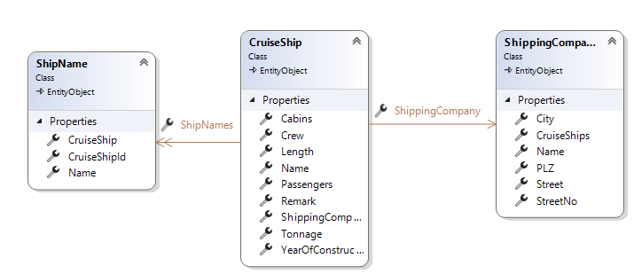
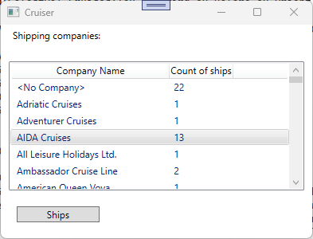
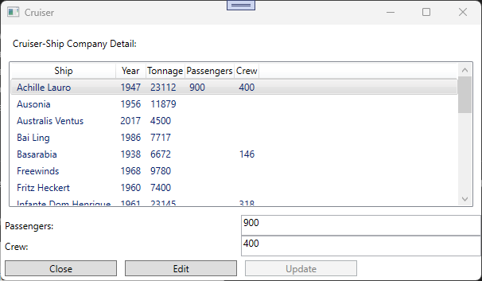
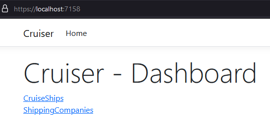
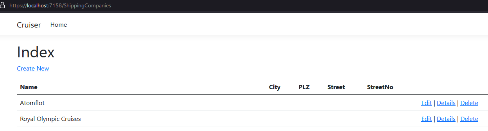
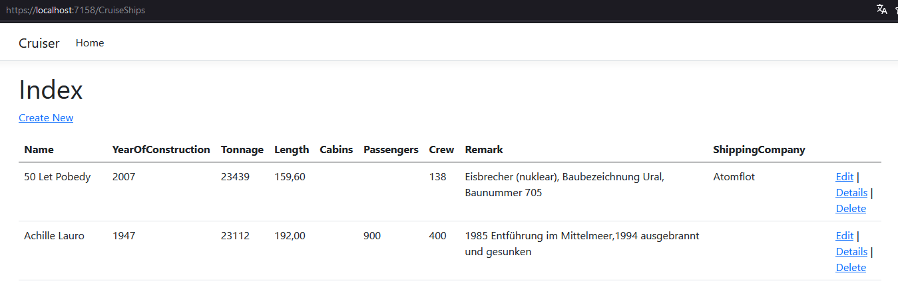
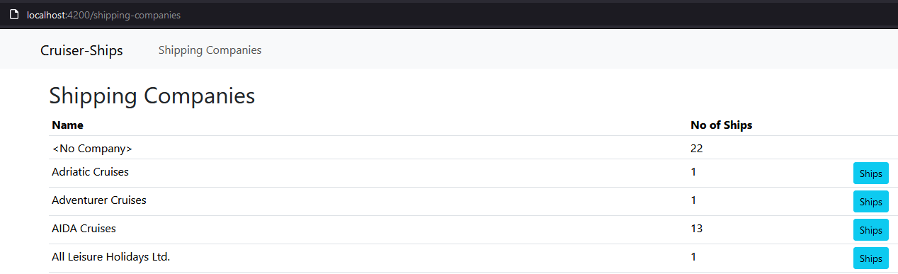
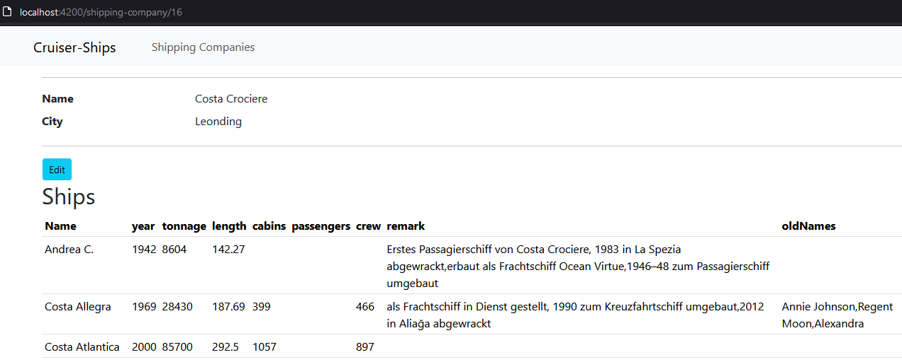
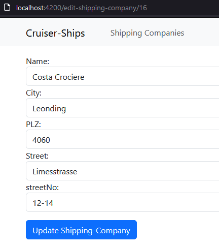

# Cruiser

## Lehrziele

- App Struktur mit `Core` und `Persistence`  
- Wpf Mvvm: `ValidatableBaseViewModel`, `NotifyPropertyChanged`, `RelayCommand`, `WindowNavigator`
- Wpf UnitTest für ViewModel / Repository
- Design und Entwicklung einer GUI-Anwendung (Angular/Razor).

## Aufgabenstellung

Aus einem bekannten Lexikon wurden die Daten von Kreuzfahrtschiffen extrahiert (CSV).   
Gesucht ist ein Programm zur Anzeige dieser Daten.

## Task 1 - Datenstruktur

Aktuell verwendet das System folgende Datenstruktur:



In den Entities werden folgende Daten gespeichert:

* *CruiserShip*  
  Hier werden die Basis-Daten des Kreuzfahrschiffs definiert.  
  Die Tabelle enthält: z.B.: **Name**, **Cabins** (Anzahl Kabinen), **Passangers** (max. Passagiere), ...    

* *ShippingCompany*  
  Definiert eine Reederei.  
  Bitte beachten Sie, dass nicht jedes Schiff einer Reederei zugeordnet ist. 

* *ShipName*  
  Schiffe wechseln den Besitzer und bekommen anschließend einen neuen Namen.  
  Die alten Namen werden in dieser Tabelle abgelegt.  
  Hinweis: der aktuelle Name ist in der Tabelle *CruiserShip* enthalten.

Folgende Punkte sind umzusetzen:

* Erstellen Sie eine DB-Migration.  
  
## Task 2 - Import

Die Daten der Schiffe sind in einer Textdatei (Csv-Format) gespeichert.

```
Name;BJ;BRZ;Laenge;Kab;Pass;Bes;Reederei;Bauklasse;Bemerkungen
Achille Lauro;1947;23.112;192,00;;900;400;;;1985 Entführung im Mittelmeer,ex Willem Ruys,1994 ausgebrannt und gesunken
```

Umzusetzen ist:

* Die Schiffe werden in die Datenbank übernommen (CruiserShip).    
* Es werden automatisch die Reedereien (ShippingCompany) angelegt. 
* Aus der Spalte "Bemerkungen" werden die alten Schiffsnamen bestimmt:  
  Diese beginnen mit `"ex "` und können mehrfach vorkommen - getrennt durch einen Beistrich.  
  Schiffsnamen, die in der Spalte "Bemerkungen" erkannt werden, müssen aus dieser entfernt werden.

## Task 3 - WPF

Die Verwaltung der Kreuzfahrtschiffdaten soll/wird als WPF Anwendung umgesetzt.
Es sollen folgende Use-Cases unterstützt werden.

### Übersicht aller Reedereien  



* Mit dem Button "Ships" werden alle Schiffe der Rederei angezeigt.  
  Bitte beachten Sie: der Button ist nur aktiv, wenn eine Reederei ausgewählt (selektiert) wurde.
* Schiffe, die keiner Reederei zugeordnet sind, werden unter "\<No Company>" zusammengefasst.  
  Auch hier ist der Button "Ships" aktiv, obwohl eigentlich keine Reederei ausgewählt ist.


### Anzeige und Bearbeitung der Schiffe einer Reederei

Entwerfen und implementieren sie folgenden Dialog:

* Der Dialog wird aus dem Hauptfenster aufgerufen (Button: Ships).
* Mit dem Button **Close** (immer aktiv) kann der Dialog beendet werden.  
* Es werden alle Schiffe einer übergebenen Reederei angezeigt.
* Es können auch Schiffe angezeigt werden, die *keiner* Reederei zugeordnet sind.
* Daten der Schiffe können bearbeitet werden (zur Vereinfachung nur: **Passagiere** und **Crew-Mitglieder**)  

Für die Bearbeitung der Schiffe gilt folgendes vorgehen:
* Bei jeder Selektion eines Schiffes werden die Daten (Passagiere, Crew-Mitglieder) in die Edit-Felder übernommen.

* Ist ein Schiff selektiert, kann mit dem Button Edit" der Bearbeitungsmodus gestartet werden.
* Der Bearbeitungsmodus wird (ungefragt) beendet, wenn ein neues Schiff selektiert wird.  
  Hinweis: der Button **Edit** ist nur aktiv, wenn auch der Bearbeitungsmodus gestartet werden kann. Im Bearbeitungsmodus ist er deaktiviert.
* Im Bearbeitungsmodus ist der Button "Update" aktiv. Er speichert (ohne Rückfrage) die geänderten Schiffsdaten.  
  Nach dem Speichern werden die Daten neu geladen! 

Der Dialog könnte wie folgt aussehen:



## Task 4 - API

Die Kreuzfahrtschiffdaten sollen als REST API bereitgestellt werden.

### REST: Reederei

Erstellen Sie eine REST Schnittstelle für die ShippingCompany (Reederei).  
Hinweis: Diese wird in der Angular Anwendung benötigt und verwendet. 

* Zusätzlich zum Standard REST wird eine Endpunkt für die Bestimmung der Reederei-Zusammenfassung benötigt (Daten wie bei WPF Hautpdialog).
* Die REST Aufrufe liefern im Dto die zugeordneten Schiffe. Beim Speicher werden diese jedoch ignoriert.
```
public record ShippingCompanyDto(
    int                    Id,
    string                 Name,
    string?                City,
    string?                Plz,
    string?                Street,
    string?                StreetNo,
    IList<CruiserShipDto>? CruiseShips);
```

## Task 5 - Razor

### Main



Die Hauptseite der Razor Anwendung enthält "nur" zwei Links:  

* Verwaltung/Bearbeitung: Reedereien
* Verwaltung/Bearbeitung: Kreuzfahrtschiffe

Mit dem Razor CRUD Wizard können Tempates für diese Pages angelegt werden:

* Die Spalte **RowVersion** darf nicht angezeigt werden.  
* Anstatt direkt auf die Datenbank zuzugreifen (DbContext) ist das **IUnitOfWork** zu verwenden.  

### Verwaltung/Bearbeitung: Reedereien



### Verwaltung/Bearbeitung: Kreuzfahrtschiffe



* Die Reederei muss bei der **Edit**-Page eine html-select sein.
* Es ist auch möglich, "keine" Reederei zuzuordnen.

## Task 6 - Angular

### Main

Die Startseite der Angular Anwendung zeigt (wie die WPF Applikation) eine Übersicht der Reedereien an:

* In der ersten Spalte der enthaltenen Tabelle wird der Name der Reederei angezeigt.
* Eine weitere Spalte enthält die Anzahl der Schiffe, die dieser Rederei gehören.
* Nicht alle Schiffe werden einer Reederei zugeordnet.  
  In einer Zeile **\<No Company>** werden diese Schiffe zusammengefasst.
* Die letzte Spalte enthält einen Button zur Navigation auf die nächste Seite (Anzeige Schiffe einer Reederei).  
  Achtung: Dieser Button wird nur angezeigt, wenn eine Reederei vorhanden ist. 

Die Seite kann wie folgt aussehen:



### Schiffe einer Reederei

Die Seite zeigt allgemeine Informationen über eine Reederei an (Name, Stadt, ...) und sie enthält alle Schiffe der Reederei in einer Liste (Tabelle).

* Beim Aufruf dieser Seite wird die Reederei übergeben.  
* Im oberen Teil der Seite werden die allgemeinen Informationen der Reederei angezeigt.
* Ein Button **Edit** ist vorzusehen, der für die Bearbeitung (nächste Seite) einer Reederei verwendet werden kann.
* Im unteren Teil der Seite werden die Schiffe tabellarisch angezeigt.  
* Die alten Namen der Schiffe werden in eine Spalte (durch Beistrich getrennt) angeführt.

Die Seite kann wie folgt aussehen:



### Reederei bearbeiten

Mit dieser Seite können die allgemeinen Daten (Name, Stadt, ...) einer Reederei bearbeitet werden.

* Beim Aufruf dieser Seite wird die Reederei übergeben.  
* Mit dem Submit Button (Update Shipping-Company) der Form werden die Daten der Reederei gespeichert. 

Die Seite kann wie folgt aussehen:


