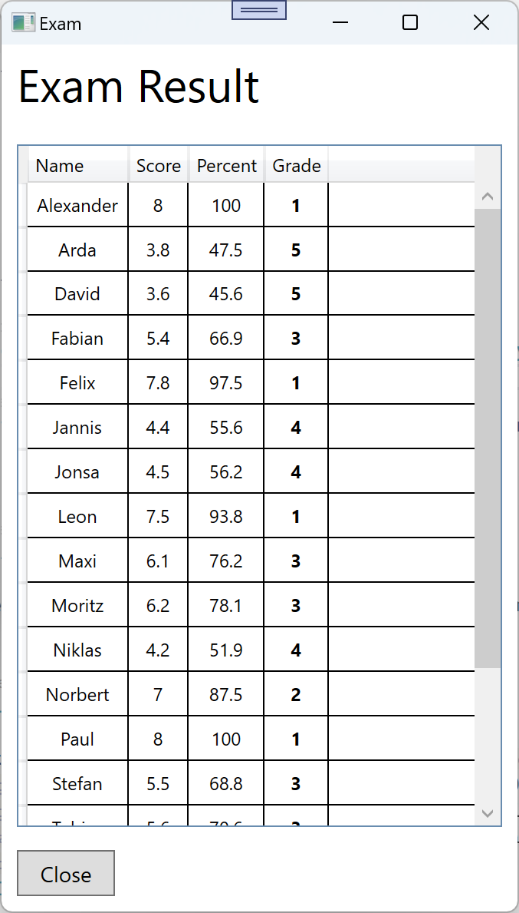

# Exam

## Lehrziele

- Wpf XAML Layouts, Styles
- Wpf Mvvm: `BaseViewModel`, `NotifyPropertyChanged`, `RelayCommand`, `WindowNavigator`
- Wpf mit: `DependencyInjection`  
- Wpf UnitTest für ViewModel

## Aufgabenstellung

Prüfungsergebnisse liegen als Csv Datein vor.  Die gesuchte Anwendung importiert die Dateien in die Datenbank. Anschließend soll das Ergebnis (die Noten) der Prüfungen berechnet und angezeigt werden.

## UI

### MainWindow


Hinweis: das Layout soll dem hier angeführten entsprechen.

#### Daten

Alle im System vorhandenen Prüfungen werden in einer Liste angezeigt.  
* *Date*:  
  Datum der Prüfung  
* *Name*:  
  Prüfungsart (z.B. LF, Test). Der Text wird aus der Csv Datei (Dateiname) übernommen.  
  
#### Buttons

Die Buttons sind mit folgenden Funktionen belegt:

| Button                          | Funktion                                                                                                                                                                                                                                                                                                                                                                                                                                                                                                                                                                                                        | Ausführbar                                      |
| ------------------------------- | --------------------------------------------------------------------------------------------------------------------------------------------------------------------------------------------------------------------------------------------------------------------------------------------------------------------------------------------------------------------------------------------------------------------------------------------------------------------------------------------------------------------------------------------------------------------------------------------------------------- | ----------------------------------------------- |
| Import Csv | Startet den Dialog zum Importieren von Csv Dateien. Nachdem der Import Dialog angezeigt wurde, muss die Liste neu geladen werden. | Immer |  
| Result | Startet den Dialog zum Anzeigen des Prüfungsergebnisses für die aktuell selektierte Prüfung.| Nur wenn eine Prüfung ausgewählt ist. |  

### ImportWindow


Erstellen Sie ein ähnliches Layout.

#### Daten

Die im Dialog enthaltene Liste zeigt alle noch nicht importierten Csv Dateien an.
In der Klasse *ImportController* ist die Berechnung der Liste dürchzuführen. Damit kann diese auch in der ImportConsolApp verwendet werden.  

#### Buttons

Die Buttons sind mit folgenden Funktionen belegt:

| Button                          | Funktion                                                                                                                                                                                                                                                                                                                                                                                                                                                                                                                                                                                                        | Ausführbar                                      |
| ------------------------------- | --------------------------------------------------------------------------------------------------------------------------------------------------------------------------------------------------------------------------------------------------------------------------------------------------------------------------------------------------------------------------------------------------------------------------------------------------------------------------------------------------------------------------------------------------------------------------------------------------------------- | ----------------------------------------------- |
| Import | Die aktuell selektierte CsvDatei wird importiert. Die Verarbeitung wird an den *ImportController* weitergeleitet. Nach dem Importieren muss die Liste neu geladen werden!| Nur aktiv, wenn eine Zeile in der Liste selektiert ist.|  
| ImportAll | Alle Csv-Dateien werden Importiert! Auch hier muss die Liste nach der Verarbeitung neu geladen werden.| Aktiv, wenn Csv-Dateien zum Importieren vorhanden sind.|  
| Close | Schließt das Fenster.| Immer |  

### ExamResult



Erstellen Sie ein ähnliches Layout.

* Die Note ist fett zu schreiben.
* Die erreichten Punkte und der Prozentsatz ist auf eine Nachkommastelle zu runden.


#### Daten

Im ExamRepository (nicht im ViewModel) werden die Daten berechnet und als fertige Liste zur Anzeige zurückgegeben.  
Für die Gesamtpunkte muss ein Kreuzprodukt berechnet werden. Die erreichbaren Punkte pro Frage muss mit dem erreichten Prozentsatz multipliziert werden.
Beispiel:  
    Frage1: Punkte:2, Erreicht: 0,5 (=50%)
    Frage2: Punkte:4, Erreicht: 0,75 (=75%)
    => Ergebnis (=Score) 2*0,5 + 4*0,75 = 4
    => Der Gesamtprozentsazt ist dann: 4 / (2+4) = 0,66666 => 66,7%

Die Note errechnet sich aus:
``` 
        int ToGrade(double percent)
        {
            return (percent*100.0) switch
            {
                >= 92.0 => 1,
                >= 81.0 => 2,
                >= 66.0 => 3,
                >= 50.0 => 4,
                _       => 5
            };
        }
```
#### Buttons

Die Buttons sind mit folgenden Funktionen belegt:

| Button                          | Funktion                                                                                                                                                                                                                                                                                                                                                                                                                                                                                                                                                                                                        | Ausführbar                                      |
| ------------------------------- | --------------------------------------------------------------------------------------------------------------------------------------------------------------------------------------------------------------------------------------------------------------------------------------------------------------------------------------------------------------------------------------------------------------------------------------------------------------------------------------------------------------------------------------------------------------------------------------------------------------- | ----------------------------------------------- | 
| Close | Schließt das Fenster.| Immer |  

## Datenmodell


* `Exam`  
  Beinhaltet alle Prüfungen. Gespeichert wird hier der Prüfungsname (=Name) und das Prüfungsdatum (=Date).  
  Die Kombination 'Name' und 'Date' ist eindeutig.
* `ExamQuestion`  
  Für eine Prüfung werden in dieser Tabelle alle Fragen gespeichert (Master-Detail).  
  Für jede Frage ist die Nummer (=Number, eindeutig aber nicht fortlaufend) und die maximal zu erreichende Punkteanzahl (=Points) zu speichern.
* `Examaminee`  
  Die Tabelle beinhaltet alle Prüfungskanditaten.  
  Der 'Name' ist eindeutig.  
* `ExamineeExamQuestion`  
  Beinhaltet das Ergebnis (=ScorePercentage) eines Prüfungskandidatens bei einer Prüfungsfrage (n:m Beziehung).  
  Hinweis: der FK nach Exam ist nicht notwendig, er erleichter aber die Programmierung.  
    
## Csv Import

Prüfungsergebnisse werden durch eine Csv Datei übernommen. Diese müssen wie folgt aussehen:

Dateiname: 20231124_LF1_Fabian.csv

* Am 24.11.2023 fand die Prüfung statt.
* Der Prüfungsname ist LF1
* Die Datei ist für den Prüfungskandidaten 'Fabian'  

Die einzelnden Felder werden durch das Zeichen _ getrennt.

Dateiinhalt:
```
1;1
2;1
3;0.8
4;0.8
5;1
6;0
7;0.5
8;0.25
```
* 1.Spalte: Fragenummer
* 2.Spalte: Ergebnis für diese Frage, Wertebereich [0..1]

Bitte beachten Sie:
* Noch nicht vorhandene Daten wie z.B. Prüfung (=Exam), Frage (=ExamQuestion) und Kandidat (=Emaminee) werden automatisch angelegt.  
Schreiben Sie sinvolle Defaultwerte (z.B. Prüfungsfrage: "Question 1", Punkte = 1).
* Ein Überschreiben (nochmaliger Import der selben Datei) ist nicht vorzusehen (es darf/muss ein Fehler auftreten).  

## UnitTest

Schreiben Sie Unittests für ein ViewModel.

* Testen Sie, ob der Button "Result" (MainWindow) deaktiviert ist, wenn keine Prüfung ausgewählt ist.
* Testen Sie, ob nach dem Aufruf von LadDataAsync die Daten in der Observable Collection enthalten sind.
