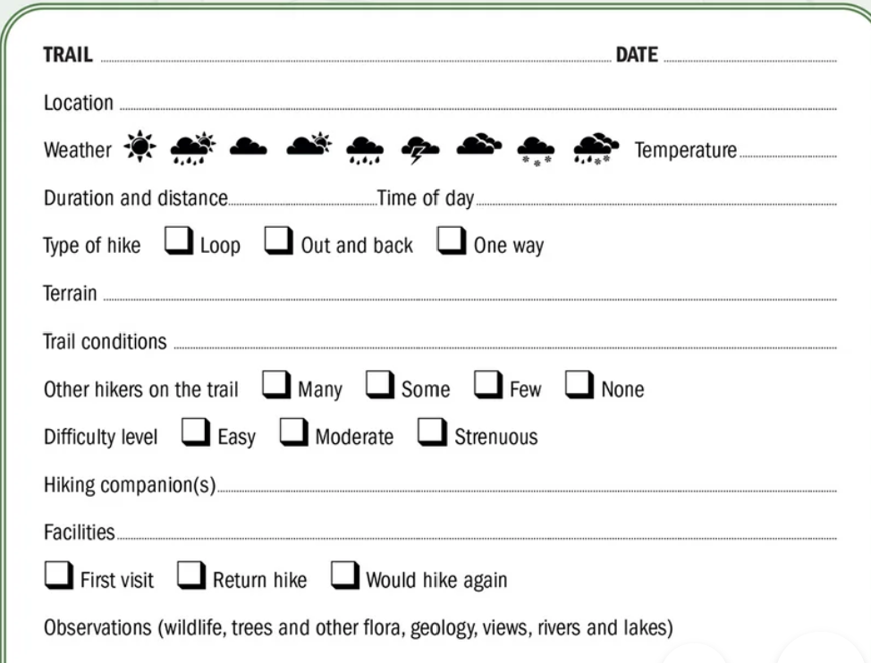
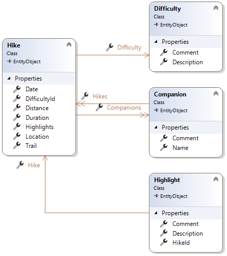
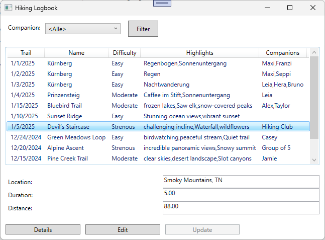
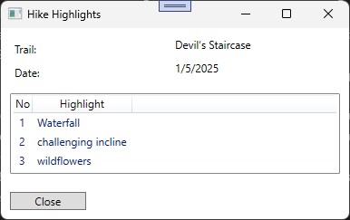

# Hiking Logbook

## Lehrziele

- App Struktur mit `Core` und `Persistence`  
- Wpf Mvvm: `BaseViewModel`, `NotifyPropertyChanged`, `RelayCommand`, `WindowNavigator`

## Aufgabenstellung

Ein Wanderclub ist an sie herangetreten, für die Mitglieder eine PC basierte Logbuch-Anwendung zu erstellen.

Als Beispiel, wie das Logbuch aussehen könnte, hat der Verein ihnen eine Demoseite (Papier) zukommen lassen: 



## Task 1 - Datenstruktur

Basierend auf dem Beispielausdruck wurde die folgende Datenbankstruktur erstellt.




In den Entities werden folgende Daten gespeichert:

* *Hike*  (Wanderung)  
  Hier werden die Basis-Daten jeder Wanderung gespeichert.  
  Die Tabelle enthält  **Trail** (Wegbeschreibung), **Date**, **Duration** (Dauer in Stunden), ...    

* *Difficulty*  (Schwierigkeit)  
  Achtung: Initial werden nur die Schwierigkeiten aus dem Ausdruck (Easy, Moderate, Strenuous) übernommen. 

* *Highlight*    
  Eine Wanderung kann mehrere Höhepunkte haben. Sie werden in dieser Tabelle gespeichert.

* *Companion*   
  Hier sind *alle* Wanderbegleiter gespeichert. 
  Hinweis: m:n Beziehung  

Diese Datenstruktur ist noch nicht fertiggestellt. In zukünftigen Versionen muss sie noch erweitert werden (können).

Folgende Punkte sind umzusetzen:

* Machen sie sich mit dieser Datenstruktur vertraut.  
  
## Task 2 - Import

Die Daten der Vereinsmitglieder sind bereits heute  in einem Excel Dokument gespeichert. 
Für die Übernahme in das neue Programm wurden diese in eine Textdatei (Csv-Format) exportier.

```
Trail;Date;Location;Duration;Distance;Difficulty;Companions;Highlights
Kürnberg;01.01.2025;Leonding;3,3;5,2;Easy;Maxi,Franzi;Sonnenuntergang,Regenbogen
...
```

Hinweis: einigen Demodaten wurden mit chatgpt generiert!

* Trail => Bezeichnung der Wanderung
* Companions => Durch Beistrich getrennte Begleiter, entfernen Sie leading und trailing Leerzeichen.  
* Highlights => Durch Beistrich getrennte Highlights
* Difficulty => erlaubt sind nur die oben angeführten Texte (Easy, Moderate, Strenuous)
usw.

Umzusetzen ist:

* Die Tabelle *Difficulty* wird mit den konstanten Werten initialisiert.  
* Die Wanderungen werden aus der Csv Datei übernommen. 
* *Highlights* sind für jede Wanderung eindeutig.
  (einen "Sonnenuntergang" kann es bei verschiedenen Wanderungen geben, nicht aber bei der selben)
* *Companions*  Noch fehlende Begleiter werden automatisch angelegt, vorhandene verwendet.  
  Achtung: m:n Beziehungen können über Navigation Properties gepflegt werden.

## Task 3 - WPF

Die Verwaltung der Wanderungen soll/wird als WPF Anwendung umgesetzt.
Es sollen folgende Use-Cases unterstützt werden.

### Übersicht aller Wanderungen  



* Die Auswahl (Combobox) enthält alle in der Db gespeicherten Companions.  
  Zusätzlich wird der Eintrag *\<Alle\>* aufgenommen (Vorauswahl).
* Beim Drücken der Schaltflächen "Filter" (oder beim Programmstart) werden alle Wanderungen der durch die Combobox ausgewählten Companion (Begleiter) geladen und angezeigt.  
* Die Liste zeigt die gefundenen Wanderungen an. Achten Sie auf die Spalten *Highlights* und *Companions*.  
  Die Daten werden in dieser Spalte durch einen Beistrich getrennt angezeigt.  
* Mit dem Button "Details" werden zusätzliche Daten der aktuell selektierten Wanderung angezeigt (Aufruf eines neuen Dialogs).  
  Bitte beachten Sie: der Button ist nur aktiv, wenn die Wanderung ausgewählt (selektiert) wurde.
* Mit den Buttons "Edit" (Freischalten der Änderung) und "Update" (Übernehmen der Änderung) können die Werte *Location*, *Duration* und *Distance* verändert werden.  
  Achten Sie darauf, dass die Buttons richtig aktiviert werden und die Änderungen nur so gespeichert werden.  
  Hinweis: ReadOnly für die Felder wenn nicht aktiv.

### Detailanzeige einer Wanderung

Entwerfen und implementieren sie den folgenden Dialog:

* Der Dialog wird aus dem Hauptfenster aufgerufen (Button: Details).
* Mit dem Button **Close** (immer aktiv) kann der Dialog beendet werden.  
* Basisdaten der Wanderung werden im oberen Teil des Dialogs angezeigt (**Trail** und **Date**).  
* Für eine Wanderung werden alle Highlights angezeigt.
  Hinweis: Die Liste enthält als erste Spalte eine fortlaufende Nummer.

Der Dialog könnte/sollte wie folgt aussehen:



