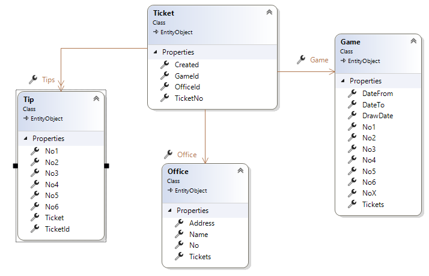
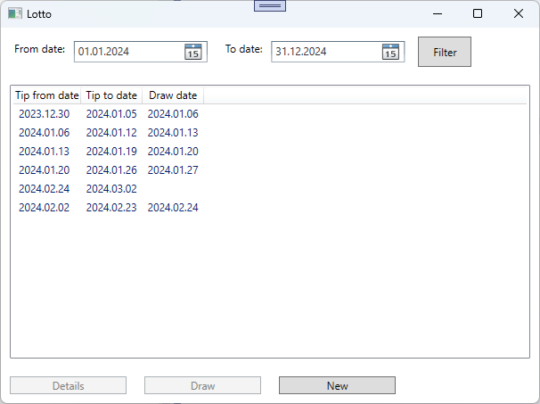

# Lotto

## Lehrziele

- App Struktur mit `Core` und `Persistence`  
- EF
- Wpf XAML Layouts, Styles
- Wpf Mvvm: `ValidatableBaseViewModel`, `NotifyPropertyChanged`, `RelayCommand`, `WindowNavigator`
- Wpf mit: `DependencyInjection`  
- Wpf UnitTest für ViewModel / Repository
- Design und Entwicklung einer GUI-Anwendung.

## Aufgabenstellung

Ein Lottogesellschaft hat ein Verwaltungsprogramm für ihre Spiele beauftragt.
Das System muss folgende Punkte erfüllen:

* Verwaltung der Spiele.  
* Berechnung einer Ziehungsstatistik.
* Online Abgabe von Tipps.

Ein unfertiges System liegt bereits vor. Erweitern Sie diese, sodass die Anforderungen der Lottogesellschaft erfüllt werden.

## Task 1 - Datenstruktur erweitern

Aktuell verwendet das System folgende Datenstruktur:

Zu erweitern ist:

* Es sollen unterschiedliche Spiele (1 aus 45 oder 1 aus 49) unterstützt werden. Der Maximalwert (z.B. 45) wird bei der Anlage eines Spieles festgelegt.
* Erweitern Sie die Adresse eines `Office` (=Tipp-Annahmestelle).
  Eine Adresse besteht aus City, PLZ, Street+No
  Das Bundesland (=State) soll in einer eigenen Tabelle gespeichert werden.
* Wenn ein Spiel beendet wird (ein Benutzer muss diese Aktion auslösen), speichert das System das Ergebnis - Wie viele 6er, 5er, 5er mit Zusatzzahl.  
* Unterscheiden sie zwischen Ziehungsdatum (DrawDate) und erwarteten Ziehungsdatum.  

## Task 2 - Lotto Verwaltung

Die Lotto Verwaltung soll/wird als WPF Anwendung umgesetzt.
Es sollen folgende Use-Cases unterstützt werden.

### Übersicht (mit Filtermöglichkeit) aller Spiele  

* Mit dem Button "Detail" werden Details zum Spiel angezeigt.
* Ein noch fehlender Button "Draw" wechselt bei noch aktiven Spielen (der Zeitraum muss abgelaufen sein und es gib noch keine Ziehung) in den Dialog zum Abschließen eines Spieles (siehe Task x).  

### Anlage eines neuen Spiels

Entwerfen und implementieren sie folgenden Dialog:

* Der Dialog wird aus dem Hauptfenster aufgerufen (neuer Button).
* Es kann nur ein zukünftiges Spiel angelegt werden (verwenden Sie für die Prüfung DateTime.Today)  
  Jedes Datum muss in der Zukunft liegen und das Von-Datum muss vor dem Bis-Datum sein. Das Datum für die Ziehung muss nach dem Bis-Datum liegen.  

### Beenden eines offenen Spiels

Ein offenes Spiel (noch keine Ziehung angegeben, sowohl Datum als auch Werte) kann "Abgeschlossen" werden.  
Dabei erfasst der Anwender die gezogenen Zahlen und startet die Auswertung.

* Die gezogenen Zahlen müssen überprüft werden:
  * keine doppelte Zahlen.
  * gültiger Wertebereich.

* Die Zahlen werden in der Datenbank in aufsteigender Reihenfolge gespeichert - die Erfassung kann beliebig sein.

* Nur bei korrekten Zahlen kann die Auswertung gestartet werden.  

## Task 3 - Lotto API

### REST: Office

Erstellen Sie eine REST Schnittstelle für die Wettbüros (Office).
Diese wird in einer Asp.net oder Angular Anwendung benötigt.

### Ticket erstellen

Ein Ticket (=Wettschein) hat mehrere Tipps. Die Web-API Schnittstelle soll einen Wettschein übernehmen können und die darauf enthaltenen (ausgefüllten) Tipps speichern. Bitte beachten Sie bei der Umsetzung:

* Die Ticketnummer wird bei der Übernahme erstellt (Guid).  
* Ein Spiel wird durch die Angabe des Ab- und Bis-Datums identifiziert.  
* Dem Aufruf werden alle relevanten Informationen übergeben.  
* Übernommen wird ein ganzes Ticket (=Lottoschein) mit mehreren Tipps.
* Ungültige Tipps werden verworfen (z.B. nur 5 Zahlen, zwei gleiche Zahlen, ...).
  Die restlichen Tipps werden aber gespeichert.
* Ein altes Ticket (für ein altes, abgeschlossenes Spiel) wird gesamt abgelehnt.
* Über die Bezahlung machen wir uns keine Sogen (=>Version2)
* Der Aufruf gibt die TicketNummer bzw. eine eindeutige Referenz  (=Quittungsnummer) zurück.

## Task 4 - Lotto Tip (ASP.NET oder Angular)

Die Angular-Anwendung hat zwei Use-Cases

### Erfassen eines neuen Tipps

### Abfrage des Gewinnstatus eines Ticket

Bei der Abfrage des Gewinnstatus ist die Ticketnummer (=Quittungsnummer) anzugeben.
Gibt der Anwender diese korrekt ein, werden (nur) für ein abgeschlossenes Spiel alle Tipps mit der Information 6er, 5er mit ZZ, ... angezeigt.  

## Task 6 -UnitTest

Schreiben Sie Unittests für ein ViewModel.

* Testen Sie, ob der Button "Result" (MainWindow) deaktiviert ist, wenn keine Prüfung ausgewählt ist.
* Testen Sie, ob nach dem Aufruf von LoadDataAsync die Daten in der Observable Collection enthalten sind.
