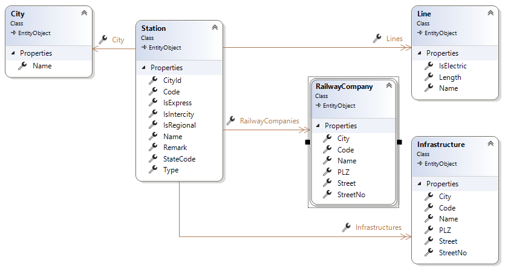
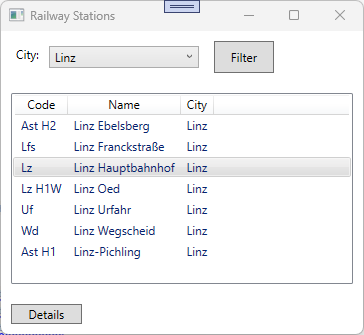
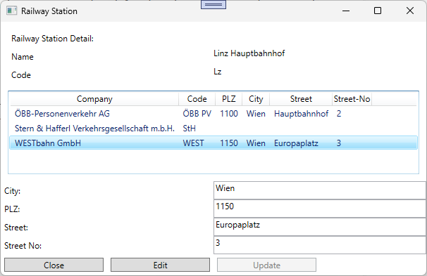
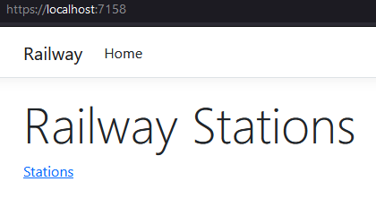
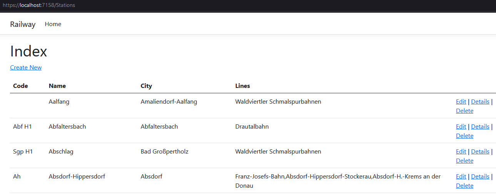
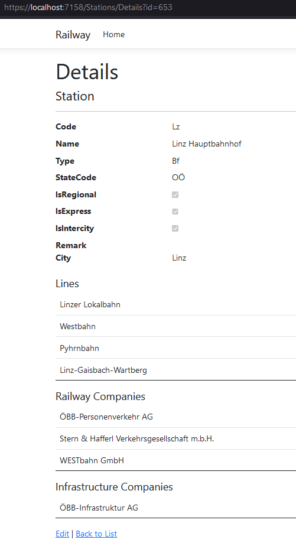
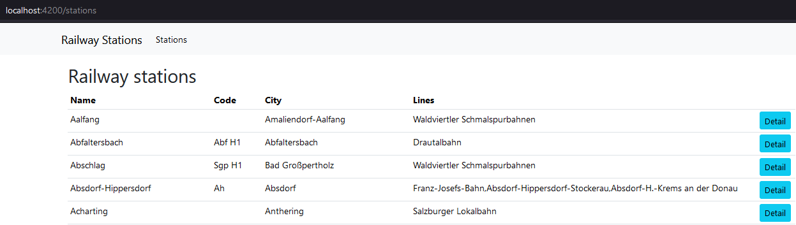
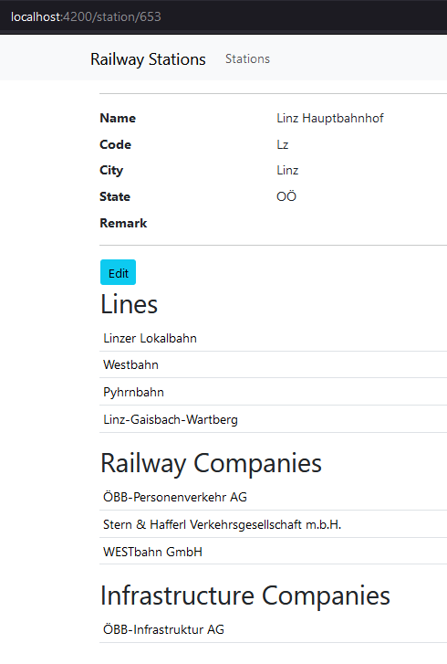
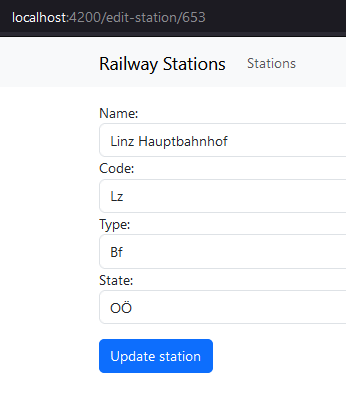

# Railway Stations

## Lehrziele

- App Struktur mit `Core` und `Persistence`  
- Wpf Mvvm: `ValidatableBaseViewModel`, `NotifyPropertyChanged`, `RelayCommand`, `WindowNavigator`
- Design und Entwicklung einer GUI-Anwendung (Angular/Razor).

## Aufgabenstellung

Aus einem bekannten Lexikon wurden die Daten aller österreichischen Bahnhöfe exportiert (CSV).   
Gesucht ist ein Programm zur Anzeige dieser Daten.

## Task 1 - Datenstruktur

Aktuell verwendet das System folgende Datenstruktur:



In den Entities werden folgende Daten gespeichert:

* *Station*  (Bahnhof)  
  Hier werden die Basis-Daten jedes Bahnhofs definiert.  
  Die Tabelle enthält: z.B.: **Name**, **Code** (ÖBB intern), **IsRegional** (ist ein Regionalbanhof), ...    

* *City*  (Stadt)  
  Definiert eine Stadt.  
  Achtung: es gibt mehrere Bahnhöfe in einer Stadt.  

* *Line*  (Bahnlinien)  
  In Österreich gibt es ca. 129 Bahnlinien. Eine Bahnlinie ist z.B. die "Franz-Josefs-Bahn", die "Linzer Lokalbahn" (LiLo), ...  
  Jeder Bahnhof wird einer *Bahnlinie* zugeordnet, wenn ein Zug dieser Line dort hält.  
  Hinweis: zwischen **Station** und **Line** wird eine m:n Beziehung verwendet.

* *RailwayCompany* (Eisenbahnverkehrsunternehmen)  
  Eisenbahngesellschaften, bei denen man sich eine Fahrkarte kaufen kann!  
  Hinweis: m:n Beziehung  

* *Infrastructure* (Infrastrukturbetreiber)  
  Diese Firmen betreiben die Infrastruktur einer Bahnlinie.  
  Hinweis: m:n Beziehung  

Unterschied: *Line*, *RailwayCompany* und *Infrastructure*  
Die Westbahnstrecke (=Line) "Wien-Salzburg" wird betrieben vom *Infrastrukturbetreiber* : "ÖBB-Infrastruktur AG".  
Auf dieser Strecke fahren Züge der beiden **RailwayCompany**: "ÖBB-Personenverkehr AG" und "WESTbahn GmbH".
 
Folgende Punkte sind umzusetzen:

* Erstellen Sie eine DB-Migration.  
  
## Task 2 - Import

Die Daten der Bahnhöfe sind in einer Textdatei (Csv-Format) gespeichert.

```
Name;Abk;Art;Standortgemeinde;BL;IB;EVU;Strecke;FV;RV;SB;Bemerkungen
Aalfang;-;Hst;Amaliendorf-Aalfang;NÖ;NÖ Bahnen;NÖ Bahnen;Waldviertler Schmalspurbahnen;;RV;	
Abfaltersbach;Abf H1;Bf;Abfaltersbach;T;ÖBB IS;ÖBB PV;Drautalbahn;;RV;;
```

* Name => Name
* Abk => Code
* Art => Type, z.B. **Bf** für Bahnhof, **Hst** für Haltestelle 
* BL => Bundesland, StateCode
* IB => Infrastrukturbetreiber, mit Beistrich getrennter Code
* EVU => Eisenbahnverkehrsunternehmen => RailwayCompanies, mit Beistrich getrennter Code
* Strecke => Bahnlinie, mit Beistrich getrennt
* FV => Fernverkehr (IsIntercity), enthält FV oder einen leeren String
* RV => Regionalverkehr (IsRegional), enthält RV oder einen leeren String
* SB => Schnellbahnhalt (IsExpress), enthält SB oder einen leeren String

Für die Infrastrukturbetreiber (IB, =Infrastructure) und Eisenbahnverkehrsunternehmen (EVU, =RailwayCompany) gibt es separate csv Dateien: (EVU.txt und IB.txt)

```
Code;Name
ÖBB PV;ÖBB-Personenverkehr AG
NÖ Bahnen;Niederösterreich Bahnen
ASB;Achenseebahn AG
```

Umzusetzen ist:

* Die Tabellen *RailwayCompany* und *Infrastructure* bekommen den Inhalt von Csv Dateien.  
* Die Bahnhöfe aus der Csv Datei werden in die Datenbank übernommen. 
* *City* und *Line* werden aus der Csv Datei "Bahnhöfe.txt" erstellt.
* Achtung: m:n Beziehungen können über Navigation Properties gepflegt werden.

## Task 3 - WPF

Die Verwaltung der Bahnhöfe soll/wird als WPF Anwendung umgesetzt.
Es sollen folgende Use-Cases unterstützt werden.

### Übersicht aller Bahnhöfe  



* Die Auswahl (Combobox) enthält alle in der Db gespeicherten Städte.  
  Als Vorauswahl wird "Linz" verwendet (Setzen Sie "Linz" beim Einstieg in den Dialog).
* Beim Drücken der Schaltflächen "Filter" werden alle Bahnhöfe der durch die Combobox ausgewählten Stadt (Ort) geladen und angezeigt.  
* Mit dem Button "Details" werden zusätzliche Daten des selektierten Bahnhofs angezeigt (Aufruf eines neuen Dialogs).  
  Bitte beachten Sie: der Button ist nur aktiv, wenn ein Bahnhof ausgewählt (selektiert) wurde.
* Zeigen Sie die drei Spalten an: Code, Name, City (Name)  

### Anzeige und Bearbeitung eines Bahnhofs

Entwerfen und implementieren sie folgenden Dialog:

* Der Dialog wird aus dem Hauptfenster aufgerufen (Button: Details).
* Mit dem Button **Close** (immer aktiv) kann der Dialog beendet werden.  
* Basisdaten eines Bahnhofs werden im oberen Teil des Dialogs angezeigt (**Name** und **Code**).  
* Für einen Bahnhof werden alle zugeordneten RailwayCompanies (Eisenbahnverkehrsunternehmen) angezeigt.
* Daten der selektierten RailwayCompany können bearbeitet werden (zur Vereinfachung nur: **City**, **PLZ**, **Street** und **StreetNo**)  

Für die Bearbeitung der RailwayCompanies gilt folgendes vorgehen:


* Bei jeder Selektion einer RailwayCompany werden die Daten (City, PLZ,Street, StreetNo) in die Edit-Felder übernommen.

* Ist eine RailwayCompany selektiert, kann mit dem Button Edit" der Bearbeitungsmodus gestartet werden.
* Der Bearbeitungsmodus wird (ungefragt) beendet, wenn eine neue RailwayCompany selektiert wird.  
  Hinweis: der Button **Edit** ist nur aktiv, wenn auch der Bearbeitungsmodus gestartet werden kann. Im Bearbeitungsmodus ist er deaktiviert.
* Im Bearbeitungsmodus ist der Button "Update" aktiv. Er speichert (ohne Rückfrage) die geänderten RailwayCompany-Daten.  
* Nach dem Speichern wird der Bearbeitungsmodus beendet und es werden die Daten neu von der Datenbank geladen. 

Der Dialog könnte wie folgt aussehen:



## Task 4 - API

Die Bahnhof-Daten sollen als REST API bereitgestellt werden.

### REST: Station

Erstellen Sie eine REST Schnittstelle für die Bahnhöfe (Station).  
Hinweis: Diese wird in der Angular Anwendung benötigt und verwendet. 

* Zusätzlich zum Standard REST wird eine Endpunkt für die Bestimmung der Bahnhof-Zusammenfassung benötigt (Daten wie bei Angular und Razor Hautpseite).
```
record StationOverview(int Id, string StationName, string? StationCode, string City, string Lines)
```

Hinweis: **Lines** ist eine durch Beistrich getrennte Liste aller Bahnlinien dieses Bahnhofs.

* Die REST Aufrufe liefern im Dto die zugeordneten Bahnstrecken (als String). Beim Speicher werden diese jedoch ignoriert.
```
    public record StationDto(
        int           Id,
        string        Name,
        string?       Code,
        string?       Type,
        string        StateCode,
        bool          IsRegional,
        bool          IsExpress,
        bool          IsIntercity,
        string?       Remark,
        string?       City,
        IList<string> Infrastructures,
        IList<string> RailwayCompanies,
        IList<string> Lines
    );
```

## Task 5 - Razor

### Main



Die Hauptseite der Razor Anwendung enthält "nur" einen Links:  

* Verwaltung/Bearbeitung: Bahnhöfe (Stations)

Mit dem Razor CRUD Wizard können Tempates für diese Pages angelegt werden:

* Die Spalte **RowVersion** darf nicht angezeigt werden.  
* Anstatt direkt auf die Datenbank zuzugreifen (DbContext) ist das **IUnitOfWork** zu verwenden.  

### Verwaltung/Bearbeitung: Bahnhöfe

#### Verwaltung/Bearbeitung: Bahnhöfe - Index



 Die erstellten/generierte Page muss angepasst werden:

* Verwenden Sie nur die Spalten: Code, Name, City, Lines (durch Beistrich getrennte Bahnlinien)
* Die Seite ist langsam: sie braucht zum Landen mehrere Sekunden!

#### Verwaltung/Bearbeitung: Bahnhöfe - Detail



* Zusätzlich zur generierten Seite wird am Ende eine Übersicht angezeigt:
  * Bahnlinien
  * Infrastruktur Betreiber
  * Eisenbahnverkehrsunternehmen 
* Achten Sie darauf, dass die Stadt angezeigt wird.

#### Verwaltung/Bearbeitung: Bahnhöfe - Edit/Delete

* Achten Sie darauf, dass die Stadt angezeigt bzw. bearbeitet werden kann.

## Task 6 - Angular

### Main

Die Startseite der Angular Anwendung zeigt eine Übersicht der Bahnhöfe an:

* Die ersten drei Spalten sind:  **Name**, **Code** und **City** (Name der Stadt) .
* Die folgende Spalte **Lines** enthält alle Bahnlinien (mit Beistrich getrennt).  
* Die letzte Spalte enthält einen Button zur Navigation auf die nächste Seite  
* Alle Daten werden mit einem einzigen Aufruf der API bestimmt (Dto: StationOverview)

Die Seite kann wie folgt aussehen:



### Details eines Bahnhofes

Die Seite zeigt allgemeine Informationen über einen Bahnhof an (Name, Code, Stadt, ...).  
Sie enthält zusätzlich alle Bahnlinien, Infrastrukturbetreiber und Bahnverwaltungen - je in einer Liste (Tabelle) - dieses Bahnhofs.

* Beim Aufruf dieser Seite wird die id des Bahnhofs übergeben.  
* Im oberen Teil der Seite werden die allgemeinen Informationen des Bahnhofs angezeigt.
* Ein Button **Edit** ist vorzusehen. Dieser startet die Bearbeitung (nächste Seite).
* Im unteren Teil der Seite werden die Bahnlinien, Infrastrukturbetreiber und Bahnverwaltungen tabellarisch angezeigt.  

Die Seite kann wie folgt aussehen:



### Bahnhof bearbeiten

Mit dieser Seite können die allgemeinen Daten (Name, Code, ...) eines Bahnhofs bearbeitet werden.

* Beim Aufruf dieser Seite wird der Bahnhof übergeben (als Id).  
* Mit dem Submit Button (Update Station) der Form werden die Daten des Bahnhofs gespeichert. 

Die Seite kann wie folgt aussehen:


