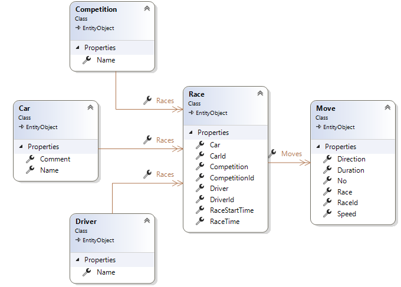
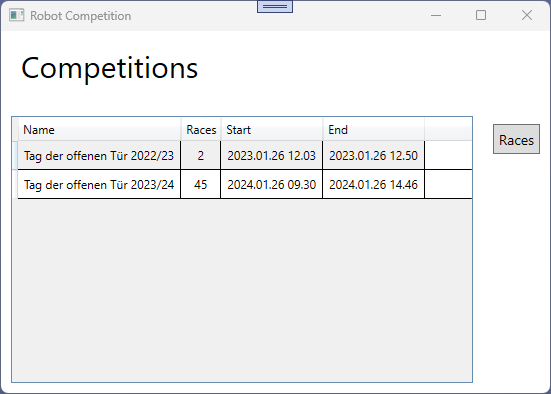
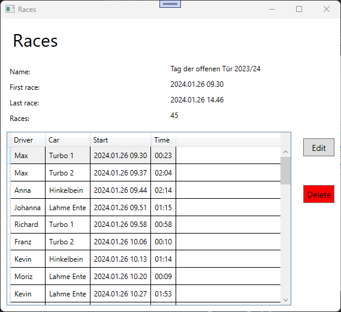
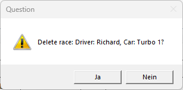
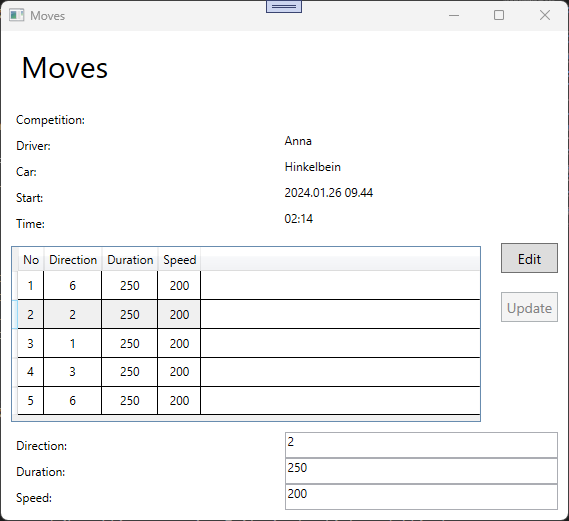
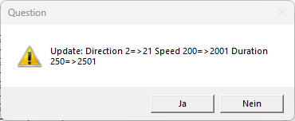

# Robot

## Lehrziele

- Wpf XAML Layouts, Styles
- Wpf Mvvm: `BaseViewModel`, `NotifyPropertyChanged`, `RelayCommand`, `WindowNavigator`
- Wpf mit: `DependencyInjection`  
- Wpf UnitTest für ViewModel

## Aufgabenstellung

Bei einem Wettbewerb werden mit einem ferngesteuerten Auto (=Robot 2WD) Rennen ausgetragen.  
Dabei steuert ein Fahrer (=Driver) das Auto (=Car). 
Steuerungsanweisungen sind Bewegungen (=Move) des Rennautos mit Richtung, Geschwindigkeit und Dauer.
Die gesuchte Anwendung soll alle Rennen speichern (importieren) und sie in einer WPF Anwendung anzeigen. 

## Daten-Übernahme

### Csv Dateien

Alle Rennen sind in einer Csv Datei gespeichert.

```
Competition;Driver;Car;RaceStartTime;RaceTime;Moves
Tag der offenen Tür 2022/23;Max;Flitzer 1;26.01.2023 12:03;01:46;5,3
Tag der offenen Tür 2022/23;Max;Lahme Ente;26.01.2023 12:50;02:01;2,5,3
Tag der offenen Tür 2023/24;Max;Turbo 1;26.01.2024 09:30;00:23;6,2,1,3,6
```

* `Competition`: Name des Wettbewerbs, z.B. "Tag der offenen Tür 2022/23"
* `Driver`: Name des Fahrers, z.B. "Max"
* `Car`: Name des Autos, z.B. "Flitzer 1"
* `RaceStartTime`: Uhrzeit beim Start dieses Rennens.  
* `RaceTime`: Gesamtzeit des Rennens (in Minuten:Sekunden)
* `Moves`: Durch Beistrich getrennte Richtungen. Die Dauer(Default = 200) und die Geschwindigkeit(Default = 255) werden nicht angegeben.

## Task 1 : Programmstruktur

Verwenden Sie das vorgegebene Programm-Template.  

* Alle Projekte sind in der Projektmappe bereits angelegt.  
  Es müssen/dürfen keine neue Projekte hinzugefügt werden.
* Die Abhängigkeiten zwischen den Projekten sind noch nicht konfigurieren und müssen gesetzt werden.  

## Task 2 : Datenstruktur



Hinweise:
* Alle Klassen erben von `EntityObject`  
  In dieser Basisklasse wird bereits die `Id` und die `Rowversion` definiert.
* Alle *Namen* (in Competition, Car und Driver) müssen eindeutig sein.
  Ein zu erstellender Db-Index überprüft diese Vorgaben.  
* Legen Sie alle Texte mit einer Maximalgröße von 256 Zeichen an (Name, Comment).

ACHTUNG!!

* Verwenden Sie für die Definition die FluentAPI.
  DataAnnotation ist in diesem Beispiel NICHT erlaubt.
* Für jedes Entity muss eine Extension Method geschrieben werden, mit der über FluentAPI das Entity definiert wird.

## Task 3 : Datenbank anlegen (Migration)

Erstellen Sie einen DbContext der sich auf eine SqlServer Datenbank verbindet.

`Data Source=(localdb)\\MSSQLLocalDB;Initial Catalog=Robot;Integrated Security=True;`

Führen Sie eine Datenbankmigration (Name: V1) durch.

ACHTUNG!

* Die Datenbankverbindung muss in der Datei *appsettings.json* definiert werden.
  Die Angabe des Connect-Strings im Programm ist nicht zulässig.
* Das Erstellen und das Aktualisieren der Datenbank (DDL) wird im Programm `ImportConsolApp` durchgeführt.

## Task 4 : Repository

Erstellen Sie für alle Entities je eine Repository Klasse.

ACHTUNG!

* Als Basisklasse verwenden Sie das `GenericRepository`
* Jedes der 5 Repositories hat ein Interface.
* Achten Sie darauf, die Klassen/Interface im richtigen Projekt anzulegen.

Schreiben Sie in den Repositories für die Entities `Competition`, `Car` und `Driver` je eine Methode, die über den *Namen* das Entity bestimmt:

`Task<Competition?> GetByNameAsync(string competitionName);`

## Task 5 : Rennen übernehmen

Schreiben Sie ein Service zum Übernehmen eines Rennens:

* class `ImportService` welches das Interface `IImportService` implementiert.
* `Task<int> ImportRaceAsync(string driver, string competition, string car, DateTime raceStartTime, TimeOnly raceTime, string moves);`  
  Als Rückgabewert liefert die Methode die Anzahl der enthaltenen Move's.

Es ist darauf zu achten, dass Fahrer, Auto und Bewerbe nur dann angelegt werden, wenn sie noch nicht existieren.

ACHTUNG!

* Das Interface wird im Projekt `Core` definiert.
* Die Implementierung von `ImportService` erfolgt im Projekt `Persistence`
* Verwenden Sie das `UnitOfWork` und die Repositories.
* Alle Abhängigkeiten (=Interface) werden im Konstruktor der Service Klasse übergeben (DependencyInjection).
* Der Parameter **moves** entspricht der Csv Datei und definiert - durch Beistrich getrennt - die Move's des Rennens. 

## Task 6 : Csv Importieren

Importieren Sie (mit dem Programm `ImportConsoleApp`) die Rennen, die in der bereitgestellten Csv Datei gespeichert sind.

ACHTUNG!

* der Task 5 könnte helfen.
* Die CsvImport\<T> Klasse kann/wird zum Lesen der Csv Datei verwendet. 
* Der DependencyInjektor erstellt die für den Import notwendigen Objekte.

## Task 7 : WPF - Hauptseite

Nach dem erfolgreichen Importieren der Daten (Task 6) kann das Hauptfenster wie folgt aussehen:




| Button | Funktion | Ausführbar |
| :- | :--------- | :--- |
| Races | Startet den Dialog zur Anzeige aller Rennen für die aktuell selektierte *Competition*. Siehe Task 8.| Nur aktiv, wenn eine Zeile in der Liste selektiert ist. |  


ACHTUNG!

* Implementieren sie diesen und alle weiteren Dialoge nach dem MVVM Pattern.   
* Die Daten werden durch ein einziges Linq Statement bestimmt! 
* Die Liste enthält *keine* Entities sondern Dto's (CompetitionSummary).
* **Start** und **End** sind die `Race.RaceStartTime` des ersten und letzten Rennens - die beiden Werte sind im Dto enthalten.

## Task 8 : WPF - Übersicht Rennen

Rennen eines Wettbewerbs werden in der WPF Anwendung wie folgt angezeigt:



| Button | Funktion | Ausführbar |
| :- | :--------- | :--- |
| Edit | Startet den Dialog zur Anzeige/Bearbeiten des selektierten Rennens. Siehe Task 9.| Nur aktiv, wenn eine Zeile in der Liste selektiert ist. |
| Delete | Löscht - nach Rückfrage - das selektierte Rennen.<br>Die *Rückfrage* ist eine MessageBox mit folgendem Aussehen:<br> | Nur aktiv, wenn eine Zeile in der Liste selektiert ist. |


ACHTUNG!

* Im oberen Teil des Dialogs werden die Daten des Wettbewerbs angezeigt. Sie können nicht geändert werden.
* Die Daten für die Liste werden durch ein einziges Linq Statement bestimmt! 
* Die Liste enthält die Entities **Race**, die aber mit *NoTracking* gelesen wurden.
* Achten Sie auf die Formatierung der **Time** Spalte! (nur Minuten:Sekunde)

## Task 9 : WPF - Übersicht Bewegungen (Moves)

Alle Bewegungen eines Rennens werden in der WPF Anwendung wie folgt angezeigt:



| Button | Funktion | Ausführbar |
| :- | :--------- | :--- |
| Edit | Startet das Bearbeiten des selektierten Moves.<br>Die Werte in den Felder im unteren Teil des Dialogs können jetzt verändert werden.| Nur aktiv, wenn eine Zeile in der Liste selektiert ist und die Bearbeitung noch nicht gestartet wurde. |
| Update | Aktualisiert den Move mit den Werten aus dem unteren Teil des Dialogs. Auch hier wird der Benutzer gefragt:<br><br>Die MessageBox enthält alle geänderte Werte, den neuen Wert und auch den alten. | Nur aktiv, wenn die Bearbeitung eines Moves gestartet wurde - siehe Button **Edit**  |


ACHTUNG!

* Im oberen Teil des Dialogs werden die Daten des Rennens angezeigt. Sie können nicht geändert werden.
* Die Daten für die Liste werden durch ein einziges Linq Statement bestimmt! 
* Die Liste enthält die Entities **Move**, die aber mit *NoTracking* gelesen wurden.
* Bei jeder Selektionsänderung werden die Werte der Bewegung in den unteren Teil des Fensters übernommen.
* Bei einer ungültigen Selektion sind die Felder im unteren Teil leer.
* Die Werte einer Bewegung(=Move) im unteren Teil des Fensters können nur verändert werden, wenn eine Aktualisierungsanforderung gestartet wurde. Ansonsten sind sie **ReadOnly**.
* Bei jeder Selektionsänderung wird eine eventuell zuvor gestartete Aktualisierungsanforderung ohne Rückfrage beendet (verworfen). 

## Task 10 : UnitTest

Alle im Projekt UnitTest vorhandenen Tests müssen funktionieren!
Achten Sie darauf, in diesem Projekt KEINE Änderungen vorzunehmen.
