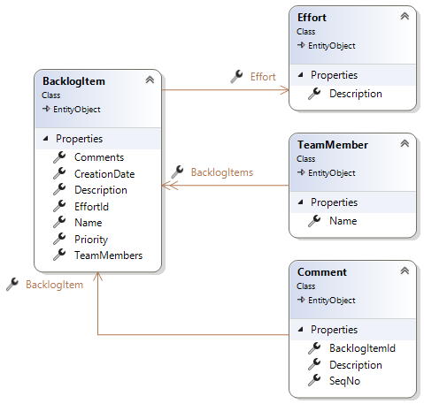

# SCRUM Backlog

## Lehrziele

- App Struktur mit `Core` und `Persistence`  
- Wpf Mvvm: `BaseViewModel`, `NotifyPropertyChanged`, `RelayCommand`, `WindowNavigator`

## Aufgabenstellung

Ein kleine Firma (die github noch nicht kennt) ist an Sie herangetreten, für die Einführung des SCRUM Vorgehensmodells
eine PC basierte Anwendung zu erstellen.

## Task 1 - Datenstruktur

Für ein Demonstrationsbeispiel wurde bereits das folgende Datenmodell erstellt.



In den Entities werden folgende Daten gespeichert:

* *BacklogItem*  
  Enthält für ein Projekt alle Backlog-Einträge (Task und User-Story).  
  Mit der Spalte **Priority** wird die Priorität des Eintrags definiert.  

* *Effort*  (Aufwand)  
  Achtung: Initial werden nur T-Shirt-Size Aufwände angelegt (XS,S,M,L,XL).  

* *Comments*  
  Zu jedem Backlog-Eintrag können beliebig viele Kommentare erfasst werden.
  Für die Sortierung wird die Spalte SeqNo (Zahl) verwendet.

* *TeamMember*  
  Hier sind *alle* Mitarbeiter (TeamMember) gespeichert.  
  Hinweis: m:n Beziehung  

Diese Datenstruktur ist noch nicht fertiggestellt. In zukünftigen Versionen muss sie noch erweitert werden (können).

Folgende Punkte sind umzusetzen:

* Machen sie sich mit dieser Datenstruktur vertraut.  
  
## Task 2 - Import

Die Firma hat versucht, mit Excel das Backlog zu pflegen.
Diese Daten sollen in das neue System importiert werden. Eine Excel Csv-Datei wird dafür bereitgestellt. 

```
Name;Description;Date;Priority;Effort;TeamMembers;Comments
Task 1 - first Task;Something TODO;01.01.2025;1;XS;Member 1, Member 2;Very easy
Task 2;DOD: Hallo Welt;31.01.2025;2;S;Member 1, Member 2, Member 3;Comment 1
...
```

* Name => Kurzbezeichnung des Backlog-Eintrags.
* Description => (lange) Beschreibung des Eintrags.
* Effort => erlaubt sind nur die oben angeführten Texte (XS, S, M, L , XL)
* Comments => Durch Beistrich getrennte Kommentare, entfernen Sie leading und trailing Leerzeichen.  
  Hinweis: Die Reihenfolge der Kommentare muss gespeichert werden (SeqNo).
* TeamMembers => Durch Beistrich getrennte TeamMembers (Achtung: Trim)

usw.

Umzusetzen ist:

* Die Tabelle *Effort* wird mit den konstanten Werten initialisiert.  
* Die Backlog-Einträge werden aus der Csv Datei übernommen. 
* *Comment* sind für jeden Backlog-Eintrag eindeutig.  
  Einen Kommentar kann es bei verschiedenen Backlog-Einträgen geben, er wir daher mehrfach erstellt.
* *TeamMember*  
  Noch fehlende TeamMember werden automatisch angelegt, vorhandene verwendet.  
  Achtung: m:n Beziehungen können über Navigation Properties gepflegt werden.

Als Umsetzungsrichtlinie gilt:  
* Der Import erfolgt mit einer einzigen Transaktion!  
  Der Aufruf von **SaveChanges** ist nur ein einziges mal erlaubt.
* Es müssen die Navigation-Properties verwendet werden.  
  Unnötige Aufrufe zu **AddRange** (im Repository) sind zu vermeiden.
* Die Spalte **Id** hat beim Import keinen (sinnvollen) Wert und ist daher nicht zu verwenden.  
  
## Task 3 - WPF

Die Verwaltung des Backlogs soll/wird als WPF Anwendung umgesetzt.
Es sollen folgende Use-Cases unterstützt werden.

### Übersicht aller Backlog-Einträge  


* Die Auswahl (Combobox) enthält alle in der Db gespeicherten TeamMembers.  
  Zusätzlich wird der Eintrag *\<All\>* aufgenommen (Vorauswahl).
* Beim Drücken der Schaltflächen "Filter" (oder beim Programmstart) werden alle Backlog-Einträge des durch die Combobox ausgewählten TeamMembers geladen und angezeigt.  
* Sortieren wird die Liste nach **CreationDate** absteigend.
* Die Liste zeigt die gefundenen Backlog-Einträge an. Achten Sie auf die Spalten *TeamMember* und *Comments*.  
  Die Daten werden in dieser Spalte durch einen Beistrich getrennt angezeigt.  
  Bei den Kommentaren wird zusätzlich die SeqNo vor den Kommentartext geschrieben.   
* Mit dem Button "Details" werden zusätzliche Daten des aktuell selektierten Backlog-Eintrags angezeigt (Aufruf eines neuen Dialogs).  
  Bitte beachten Sie: der Button ist nur aktiv, wenn der Eintrag ausgewählt (selektiert) wurde.
* Mit den Buttons "Edit" (Freischalten der Änderung) und "Update" (Übernehmen der Änderung) kann der Werte für *Priority* verändert werden.  
  Achten Sie darauf, dass die Buttons richtig aktiviert werden und die Änderungen nur so gespeichert werden.  
  Hinweis: ReadOnly für die Felder wenn nicht aktiv.

Als Umsetzungsrichtlinie gilt:  
* Das Filtern der Daten (z.B. durch die ComboBox) erledigt die Datenbank.  
* Achten Sie auf eine saubere MVVM Umsetzung.  

### Detailanzeige eines Backlog-Eintrags

Entwerfen und implementieren sie den folgenden Dialog:

* Der Dialog wird aus dem Hauptfenster aufgerufen (Button: Details).
* Mit dem Button **Close** (immer aktiv) kann der Dialog beendet werden.  
* Basisdaten des Backlog-Eintrags werden im oberen Teil des Dialogs angezeigt (**Name**, **Description**, ...).  
* Für einen Backlog-Eintrag werden alle Kommentare angezeigt.  
  Die Liste ist nach **Erstellung** absteigend sortiert (nach SeqNo desc).  
  Die Liste enthält als erste Spalte eine fortlaufende, aufsteigende Nummer (ist nicht die SeqNo).

Der Dialog könnte/sollte wie folgt aussehen:


