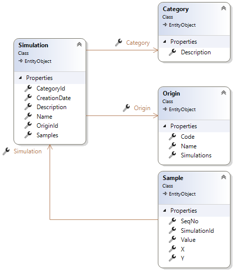
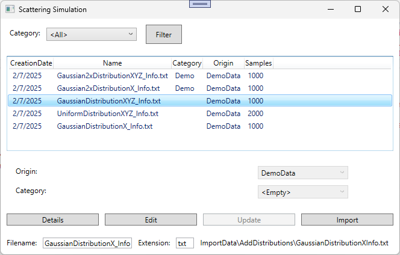
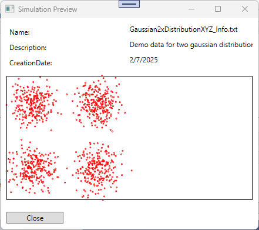

# Scattering Simulation

## Lehrziele

- App Struktur mit `Core` und `Persistence`  
- Wpf Mvvm: `BaseViewModel`, `NotifyPropertyChanged`, `RelayCommand`, `WindowNavigator`
- Wpf Custom Draw

## Aufgabenstellung

In einer Firma werden bei einem Versuchsaufbau Daten einer 2-dimensionalen Streuung erstellt und in Textdateien abgelegt. Bisher wurden diese Textdateien in Excel importiert und daraus eine Grafik erstellt.
Gesucht ist ein Programm zur Verwaltung und Anzeige dieser Daten. Excel soll dadurch abgelöst werden können.

## Task 1 - Datenstruktur

Aus den heute in Excel gespeicherten Testdaten wurde das folgende Datenmodell erstellt.



In den Entities werden folgende Daten gespeichert:

* *Simulation*  
  Alle Versuche (=Simulationen) werden hier gespeichert.  
  Die Spalten **CreationDate** (=Tag, an dem der Versuch durchgeführt wurde), **Name** (=Bezeichnung des Versuchs), ... definieren einen Versuch.  

* *Category*  (Kategorie)  
  Jede Simulation kann nachträglich einer Kategorie zugeordnet werden.  
  Diese Kategorien dienen zur besseren Einteilung der Simulationen.  

* *Origin* (Herkunft)  
  Mehrere Abteilungen der Firma (extern, intern) erstellen Simulationen.  
  Mit der Zuordnung zu einer Origin wird festgelegt, wer die Simulation erstellt hat.  

* *Sample*  
  Das Entity enthält die Einzelwerte der Simulation.  
  Ein Wert wird im zwei dimensionalen Raum erstellt mit den Eigenschaften:
  * X: 
    Wert in der X Richtung.
  * Y: 
    Wert in der Y Richtung.
  * Value:
    Intensität 

Folgende Punkte sind umzusetzen:

* Machen sie sich mit dieser Datenstruktur vertraut.  
  
## Task 2 - Import

Bei den Simulationen (Versuchen) werden die Ergebnisse in Dateien (Csv) abgelegt. 
Das gesuchte Programm soll diese Dateien lesen und für die Auswertung aufbereiten.  
Bei der Umsetzung ist darauf zu achten, dass initial die Daten gelesen werden, aber auch später neue Simulationen verarbeitet werden können.

Es gibt verschiedene Excel Csv Dateien:

### Datei: Categories.txt

```
Name
Demo
...
```

* Name => Bezeichnung der Kategorie.   

Hinweis: Sie können davon ausgehen, dass die Kategorien nicht in der DB gespeichert sind.

### Datei: Origins.txt

```
Code;Name
DEMO;DemoData
ATV1;Institut für Experimentalphysik Wien
...
```

* Code => Herkunftkürzel.   
* Name => Bezeichnung der Herkunft.   

### Datei: *_Info.txt

Die Dateien enthalten die allgemeinen Informationen einer Simulation

```
Key;Value
Description;Demo Data for gaussian distribution
Origin;DEMO
DataFile;GaussianDistributionXYZ_Data.txt
CreationDate;2025.02.07
...
```

Hinweise: 
* Sie können davon ausgehen, dass die Simulation nicht in der DB gespeichert ist.
* **Key** und **Value** sind die Spaltenüberschrift.
* Mit **DataFile** wird die Datei mit den Beispieldaten festgelegt. Die Datei muss im selben Verzeichnis liegen wie die *_Info* Datei.
* **Origin** definiert (optional) die Herkunft (Code). 
  Wenn ene Origin angegeben wurde, wird entweder die bereits in der DB vorhandenen oder eine neue erstellt.

### Datei: Daten

```
X;Y;Value
-1,862991669;0,811639886;0,665801989
-0,643377626;-0,505285674;-1,667548421
0,026345796;0,289596149;0,594384996
2,445860118;-0,004315891;0,029930158
-1,04690777;1,713315719;0,384250968
...
```

Hinweise: 
* Alle Werte sind **double** und müssen angegeben sein.

Als Umsetzungsrichtlinie gilt:  
* Der Stammdatenimport (Category, Origin) erfolgt mit einer einzigen Transaktion!  
  Der Aufruf von **SaveChanges** ist nur ein einziges mal erlaubt.
* Pro Simulation ist eine Transaktion vorzusehen.    
* Es müssen die Navigation-Properties verwendet werden.  
  Unnötige Aufrufe zu **AddRange** (im Repository) sind zu vermeiden.
* Die Spalte **Id** hat beim Import keinen (sinnvollen) Wert und ist daher nicht zu verwenden.  
  
## Task 3 - WPF

Die Verwaltung Simulationen soll/wird als WPF Anwendung umgesetzt.
Es sollen folgende Use-Cases unterstützt werden.

### Übersicht aller Simulationen  



* Die Auswahl (Combobox) enthält alle in der Db gespeicherten Kategorien.  
  Zusätzlich wird der Eintrag *\<All\>* aufgenommen (Vorauswahl).
* Beim Drücken der Schaltflächen "Filter" (oder beim Programmstart) werden alle Simulationen der durch die Combobox ausgewählten Kategorie geladen und angezeigt.  
* Sortieren wird die Liste nach **CreationDate** absteigend.
* Die Liste zeigt die gefundenen Simulationen an. Achten Sie auf die Spalten *Samples*.  
  Hier wird nur die Anzahl der Messungen angezeigt.   
* Mit dem Button "Details" wird ein neues Fester geöffnet, welches die Beispielswerte grafisch anzeigt.  
  Bitte beachten Sie: der Button ist nur aktiv, wenn die Simulation ausgewählt (selektiert) wurde.
* Mit den Buttons "Edit" (Freischalten der Änderung) und "Update" (Übernehmen der Änderung) kann der Werte für *Origin* und/oder *Category* (Achtung: Nullable) verändert werden.  
  Achten Sie darauf, dass die Buttons richtig aktiviert werden und die Änderungen nur so gespeichert werden.  
  Hinweis: ReadOnly für die Felder wenn nicht aktiv.

Als Umsetzungsrichtlinie gilt:  
* Das Filtern der Daten (z.B. durch die ComboBox) erledigt die Datenbank.  
* Das Laden der gesamten Datenbank in den Hauptspeicher ist nicht zulässig.  
* Achten Sie auf eine saubere MVVM Umsetzung.  

### Importieren neuer Simulationen  

Im Hauptdialog können neue Simulationen importiert werden.  
Der Benutzer gibt dafür 
* den Dateinamen  (Vorauswahl: GaussianDistributionX_Info)
* die Extension  (Vorauswahl: txt)

an. Daraus wird ein vollständiger Dateiname errechnet (im Verzeichnis *ImportData\AddDistributions*) und im Dialog angezeigt.  
Nur wenn diese Datei existiert darf der Button **Import** gedrückt werden.  

Nach dem Import muss die neu importierte Simulation angezeigt werden. 

### Grafische anzeige einer Simulation

Entwerfen und implementieren sie den folgenden Dialog:

* Der Dialog wird aus dem Hauptfenster aufgerufen (Button: Details).
* Mit dem Button **Close** (immer aktiv) kann der Dialog beendet werden.  
* Basisdaten der Simulation werden im oberen Teil des Dialogs angezeigt (**Name**, **Description**, ...).  
* Alle Werte (Sample) werden mit einem CustomDraw Control visualisiert.  
  Zeichnen Sie einen Kreis (mit Durchmesser 1) an die jeweilige X und Y Position.

Der Dialog könnte/sollte wie folgt aussehen:



