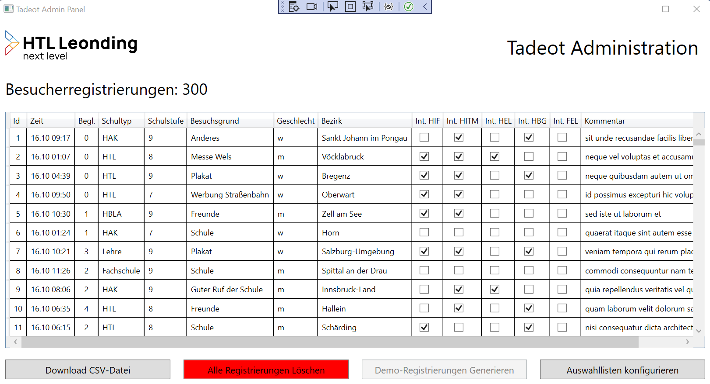
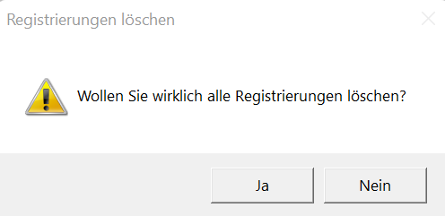
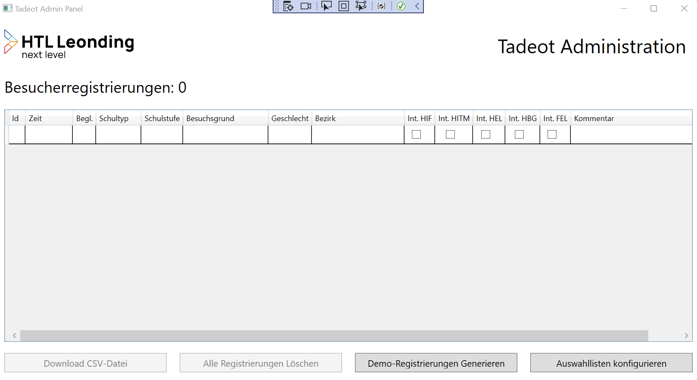
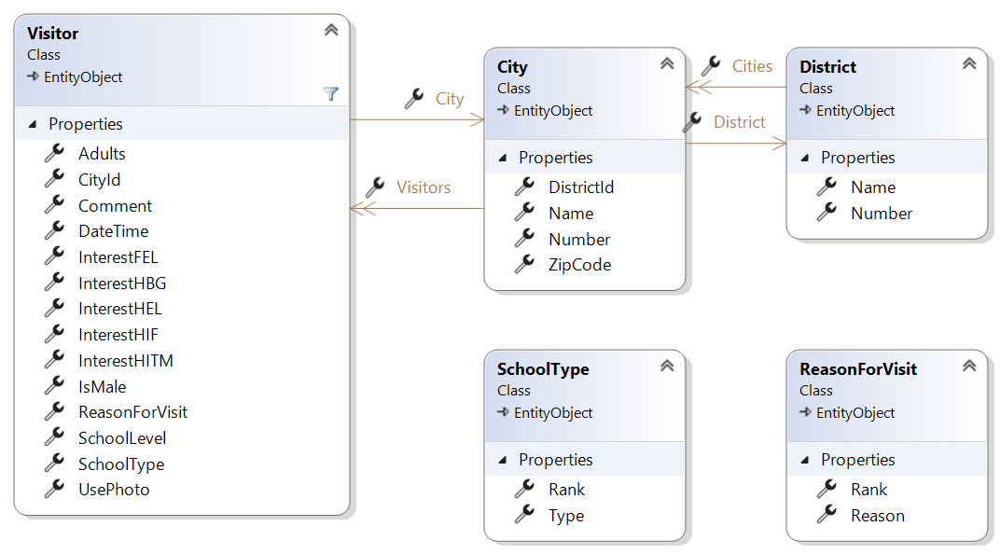
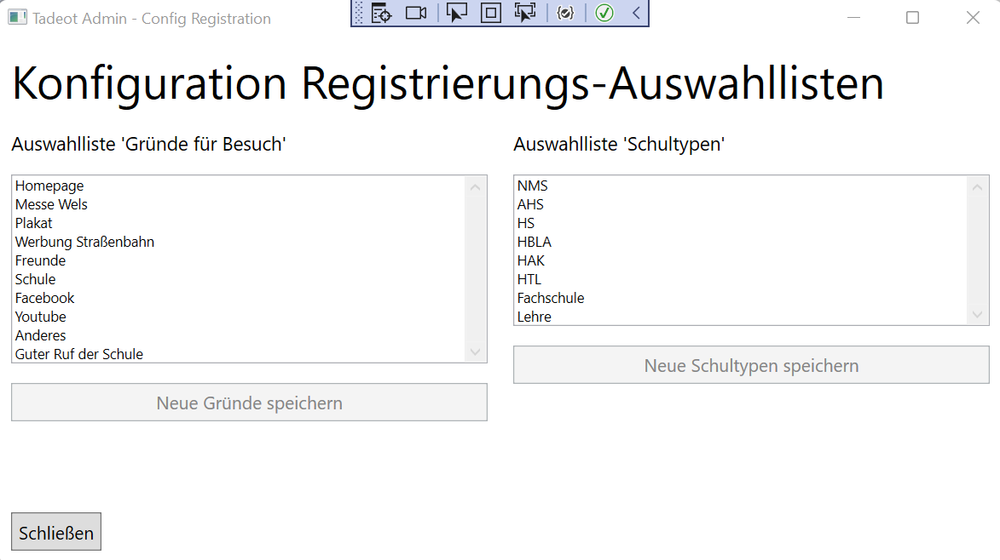

# Wpf Tadeot-Administration

Zur Administration der Besucher-Anmeldung während des Tags und Abends der Offenen Tür an der HTL Leonding soll ein Wpf-Client entwickelt werden.

- Ein Prototyp für das Registrierungsformular sowie die Statistik-Auswertung kann auf https://vm64.htl-leonding.ac.at eingesehen werden.

## Lehrziele

- Wpf XAML Layouts, Styles
- Wpf `DataGrid`
- Wpf Mvvm: `BaseViewModel`, `NotifyPropertyChanged`, `RelayCommand`, `ObservableCollection`, `WindowController`
- Wpf Datenbankanbindung:
  - `UnitOfWork` Integration
  - `Bogus` Testdatengenerator
  - `ExecuteRawSql`, EF Change Tracking
  - `Dependency Injection`, Anwendung in WPF
  - `Unittest`, Testen des ViewModels

## Aufgabenstellung

Die Hauptseite der Anwendung listet alle `Visitors` in einem `DataGrid` und zeigt in der Überschrift die Anzahl der registrierten Besucher/innen an:



Die Buttons sind mit folgenden Funktionen belegt:

| Button                          | Funktion                                                                                                                                                                                                                                                                                                                                                                                                                                                                                                                                                                                                        | Ausführbar                                      |
| ------------------------------- | --------------------------------------------------------------------------------------------------------------------------------------------------------------------------------------------------------------------------------------------------------------------------------------------------------------------------------------------------------------------------------------------------------------------------------------------------------------------------------------------------------------------------------------------------------------------------------------------------------------- | ----------------------------------------------- |
| Download CSV                    | Mithilfe eines `SaveDialog` werden alle `Visitor`-Daten in eine CSV-Datei exportiert.                                                                                                                                                                                                                                                                                                                                                                                                                                                                                                                           | Nur wenn Besucheranzahl > 0                     |
| Alle Registrierungen löschen    | Für den Echtbetrieb möchte man den Zählerstand auf 0 zurücksetzen und somit alle Testdaten löschen. <br>**Achtung**: Es reicht nicht, alle Daten aus der Tabelle zu löschen, sondern die Tabelle muss mit einem `rawSQL` Statement mithilfe des SQL `truncate` Befehls zurückgesetzt werden, damit auch die _auto-generated Ids_ wieder bei 1 beginnen! Achten Sie dabei darauf, dass der DB-Context `ChangeTracker` zurückgesetzt wird. <br>Vor dem Löschen soll eine Rückfrage erfolgen, ob man sich sicher ist, dass alle Daten gelöscht werden sollen:  | Nur wenn Besucherzahl > 0                       |
| Demo-Registrierungen generieren | Mithilfe des `Bogus`-Testdatengenerators sollen **300** simulierte Anmeldungen erzeugt und in der DB gespeichert werden. Damit wird das Testen des Datenexports und der Statistik-Slideshow ermöglicht. <br>**Optional** können Sie die Anzahl der generierten Anmeldungen über eine Number-TextBox konfigurierbar machen.                                                                                                                                                                                                                                                                                      | Nur wenn keine Besucher/innen registriert sind. |
| Auswahllisten konfigurieren     | Öffnet das Fenster `RegistrationConfigWindow` modal (`ShowDialog()`).                                                                                                                                                                                                                                                                                                                                                                                                                                                                                                                               | immer                                           |

Hier die Anzeige, wenn keine Registrierungen vorhanden sind:



## Datenmodell

Die Vorlage enthält bereits das vollständige Datenmodell für die Anwendung.



## Import

Die in der Vorlage bereits enthaltene `ImportConsoleApp` ist wie folgt zu implementieren:

- Löschen und Neuerstellen der Datenbank
- CSV-Import folgender Daten:
  - `districts.csv` enthält alle Bezirke, über die später Statistik-Auswertungen der Besucherzahlen erfolgen sollen.
  - `cities.csv` hingegen enthält alle Ortschaften und Städte, die im Registrierungsformular zur Auswahl angeboten werden. Jede `City` ist dabei mit seinem `District` über die erste CSV-Spalte verknüpft: Die ersten 3 Zeichen der Spalte `Number` entsprechen dem `Number`-Attribut eines `District`s.
  - `reasonsforvisit.csv` und `schooltypes.csv` enthalten die Vorbelegungen für die DB-Initialisierung, die später im Wpf `RegistrationConfigWindow` noch adaptiert werden können.
- Bogus-Datengenerator
  - Während des Imports sollen exakt **400** simulierte Registrierungen erzeugt und in die Datenbank abgespeichert werden.
  - Da auch der Wpf-Client später diese Funktion benötigt, soll das Generieren und Speichern der Testdaten im `VisitorRepository` zentral implementiert werden.
  - Verwendet wird dazu das nuget-Paket https://www.nuget.org/packages/Bogus

## WpfTadeotAdmin - `MainWindow`

* `UnitOfWork` Integration  
Obwohl eine korrekte Datenbank-Anbindung aus Sicherheitsgründen über ein **RESTful Service** gehen müsste, verwenden wir zu Übungszwecken eine `UnitOfWork`-Instanz direkt in den Wpf-Viewmodel-Klassen.  
* Das `ViewModel` ist von Windows getrennt. Daher Implementieren Sie die ViewModels in einer eingenen Assembly.
* Das Umschalten der Dialoge, der Win32 SaveFileDialog, ... wir in eine Klasse `WindowNavigator` ausgelagert. Im ViewModel ist nur ein Interface auf den WindowNavigator bekannt.  

## WpfTadeotAdmin - `RegistrationConfigWindow`

### Konfiguration von Auswahllisten für das Anmeldeformular

Wie auf dem Anmeldungs-Prototyp ersichtlich, gibt es bei manchen Daten verschiedene Auswahlmöglichkeiten, die sich von Jahr zu Jahr ändern könnten. Daher sollen die folgenden beiden Auswahllisten im Admin-Client konfigurierbar sein:

- Auswahlliste **Gründe für Besuch**
- Auswahlliste **Schultypen**

Bei beiden Auswahllisten werden - nur im Fall einer Änderung - jeweils alle Einträge in die Datenbank gespeichert, in der wie im UI abgebildeten Reihenfolge.

**Hinweis**:

- Da die jeweils gewählten `Visitor`-Attribute `ReasonForVisit` und `SchoolType` als `string` im Datenmodell abgebildet sind, hat eine Änderung einer Auswahlliste keinerlei Auswirkung auf bestehende Registrierungsdaten!
- Man kann also auch während der laufenden Veranstaltung noch Änderungen vornehmen, falls eine andere Reihung oder andere Einträge im Registrierungsformular gewünscht sind.

### GUI



Für die Darstellung der Auswahllisten wurden in diesem UI mehrzeilige TextBoxen verwendet, die alle Strings aus der DB mit `newline` zu einem einzigen String verkettet anzeigen. Sobald eine Änderung in der TextBox vorgenommen wird, wird der jeweilige Speichern-Button aktiviert.

Folgende Style-Properties sind dabei hilfreich:

```xml
<Window.Resources>
    <Style TargetType="TextBox" x:Key="TextList">
        <Setter Property="TextWrapping" Value="Wrap" />
        <Setter Property="AcceptsReturn" Value="True" />
        <Setter Property="VerticalScrollBarVisibility" Value="Visible"/>
    </Style>
</Window.Resources>
```  

## Unit-Test

Die Unittests sollen die ViewModels überprüfen.  
* Schreiben Sie die Unittests so, dass keine Datenbank benötigt wird.  
* Ein Beispiel ist im Template enthalten. 