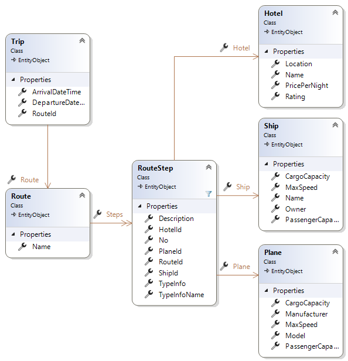

# Travel Agency

## Lehrziele

- Wpf mit: `DependencyInjection`  
- Wpf UnitTest für ViewModel / Repository
- ASP.NetRazor CRDU Wizard
- Design und Entwicklung einer GUI-Anwendung.

## Aufgabenstellung

Ein Reisebüro hat ein Verwaltungsprogramm für ihre Pauschalreisen beauftragt.
Das System muss folgende Punkte erfüllen:

* Verwaltung der Reisen.  
* Verwaltung der Reisevorschläge (Routen).
* WPF und Online Platform.

Ein unfertiges System liegt bereits vor. Erweitern Sie diese, sodass die Anforderungen des Resiesbüros erfüllt werden.

## Task 1 - Datenstruktur

* Ein *Trip* ist eine konkrete Reise mit Abfahrt und  Ankunftsdatum.
* Eine *Route* ist eine Template für eine Reise. Hier werden die einzelnen Reiseabschnitte (*RouteStep*) definiert.  
* Im *RouteStep* wird definiert, in welchem Hotel übernachtet wird, welcher Flug verwendet wird *oder* welches Schiff gebucht wird.  
  Es kann nur *eine* Auswahl getroffen werden. 

Erstellen Sie alle Entitäten und führen Sie eine Db Migration durch.

## Task 2 - Import

Einige Routen (Inklusive Hotels, Flugzeuge und Schiffe) sind in Csv Dateien gespeichert.  
Verwenden Sie für den Import das Projekt **ImportConsolApp**.

## Task 3 - Wpf Anwendung

Mit der Wpf Anwendung können neue Reisen (Trip) definiert und angelegt werden.

Es sollen folgende Use-Cases unterstützt werden.

### MainWindow: Übersicht (mit Filtermöglichkeit) 

* Das Fenster zeigt alle Reisen (Trip) an, die dem Filterkriterien (Datum) entsprechen.
* Die Liste kann nach *Datum-Von* und *Datum-Bis* eingeschränkt werden. Die Filter werden beim Drücken der Schaltfläche *Filter* angewendet.
* Die Schaltfläche *New* zeigt einen neuen Dialog zum Erstellen einer neuen Reise an.
* Die Schaltfläche *Details* (nur aktiv, wenn ein Reise in der Liste selektiert wurde) startet einen neuen Dialog zur Anzeigen der selektierten Reise.  

### Anlage einer neuen Reise

Entwerfen und implementieren sie den Dialog wie folgt:

* Der Benutzer kan die Abreise und die Ankunft (Datum) definieren.  
  Bitte beachten Sie: es sind nur zukünftige Datumsangaben erlaubt. Ist eines der beiden Angaben in der Vergangenheit, ist die Schaltfläche *Neu* deaktiviert.
* Ein einer Combobox werden alle vorhandenen Routen angezeigt. Auch hier gilt: es muss eine Route ausgewählt sein, damit die Reise (Trip) angelegt werden kann.

### Information über eine Reise

* Der Dialog zeigt alle relevanten Informationen über eine Reise an.

## Task 4 - API

Erstellen Sie REST Schnittstellen für das Reisebüro.  
Hinweis: die Rest-Schnittstellen werden für das Verwalten von
* Schiffen,
* Hotels,
* Flügen  

verwendet. Die später umzusetzende Angular Anwendung verwendet diese Schnittstellen.

## Task 5 - ASP.NET Razor

Verwenden Sie den CRUD Wizard für die Erstellung von Razor-Pages, mit denen anschließend die folgenden Objekte bearbeitet werden können:

* Routen (nur die Namen, keine Steps)
* Hotel
* Flugzeug
* Schiff

## Task 6 - Angular

In Angular sind die gleichen Seiten umzusetzen, wie diese in der ASP.Net Razor vorhanden sind.

## Task 6 -UnitTest

Schreiben Sie Unittests für ein ViewModel.

* Testen Sie, ob der Button "Result" (MainWindow) deaktiviert ist, wenn keine Prüfung ausgewählt ist.
* Testen Sie, ob nach dem Aufruf von LoadDataAsync die Daten in der Observable Collection enthalten sind.
