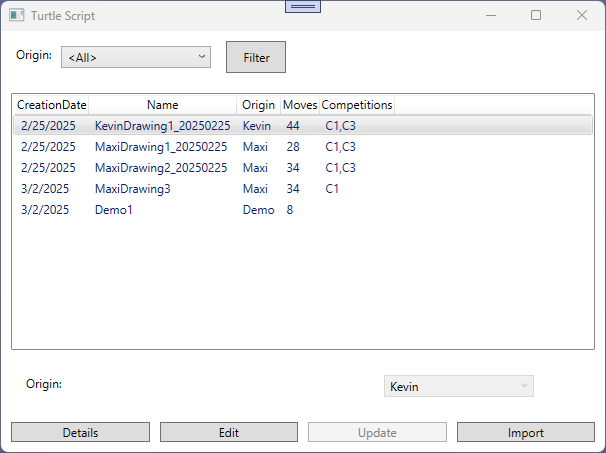

# Turtle - Competition

## Lehrziele

- App Struktur mit `Core` und `Persistence`  
- Wpf Mvvm: `BaseViewModel`, `NotifyPropertyChanged`, `RelayCommand`, `WindowNavigator`
- Wpf Custom Draw
- WebAPI
- AngularUI

## Aufgabenstellung

*Turtle* ist eine einfache Programmierumgebung, mit der man mit eine Schildkröte Zeichnungen  erstellen kann.  
Bei einem *Turtle*-Programmierwettbewerb werden die erstellten Zeichnungen gesammelt und es sollen die Teilnehmer abstimmen, wer die beste Zeichnung erstellt hat.  

Implementieren Sie ein System zum Aufbereiten und Administrieren der Zeichnungen.  
Das System muss weiters den Wettbewerbe verwalten und abwickeln können.

## Task 1 - Datenstruktur

Für das neue System wurde das folgende Datenmodell erstellt.

In den Entities werden folgende Daten gespeichert:

* *Script*  
  Die Properties einer Zeichnung (=Script) werden hier gespeichert.  

* *Move*  (Turtle Bewegungen)  
  Die Turtle bewegt sich über das Feld. Jede Bewegung (jeder Schritt) wird hier abgelegt.  
  Ein Schritt besteht aus  
  * *SeqNo*  
    Fortlaufende Nummer  
  * *Color*  
    Farbe, mit der gezeichnet wird. Wenn die Farbe *null* ist, wird in diesem Move **nicht** gezeichnet.
  * *Repeat*  
    Eine Bewegung kann wiederholt werden. z.B. kann die Schildkröte 5 mal nach rechts gehen.  
    Dann ist in diesem *Move* Repeat = 5.
  * *Direction*  
    Richtung der Bewegung:

      |  |  |   |
      | - | - | - |
      |0|1|2|
      |7| |3|
      |6|5|4|
  
    Die Schildkröte steht in der Mitte. Bei der Richtung *1* geht sie nach oben, bei *4* nach rechts unten.  

* *Origin* (Herkunft)  
  Mit der Zuordnung *Script* zu einer *Origin* wird festgelegt, wer ein Script erstellt hat.  

* *Competition*  (Wettbewerb)  
  Es sollen mehrere Wettbewerbe unterstützt werden. 
  Mit dem Property *Active* kann gesteuert werden, ob Bewertungen (Vote) abgegeben werden dürfen.  
  Hinweis: m:n Beziehung mit *Script*

* *Vote* (Abstimmung)
  Bei einem Wettbewerb kann der Anwender für jedes Script eine Note von 1 bis 5 (=Sterne) vergeben.  
  Die Abstimmung (für jedes Script) wird in der Tabelle *Vote* gespeichert.

Folgende Punkte sind umzusetzen:

* Machen sie sich mit dieser Datenstruktur vertraut.  
  
## Task 2 - Import

Beim Import sollen die (meisten) Zeichnungen in die Datenbank importiert werden.

### Verzeichnisstruktur

Jede Zeichnung ist in einer Textdatei gespeichert, die in einem Verzeichnisbaum abgelegt ist.  

Beispiel: **Kevin\KevinDrawing1_20250225.txt**

* aus den Dateinamen wird der Name der Zeichnung übernommen.  
  Im Beispiel: **KevinDrawing1_20250225**

* für die Description wird der gesamte Dateiname verwendet.  
  Im Beispiel: **Kevin\KevinDrawing1_20250225.txt**

* nur wenn vorhanden und gültig wird aus dem Dateinamen das Erstellungsdatum übernommen.  
  Im Beispiel: **2025.02.25**  
  Wenn kein gültiges Datum *am Ende* des Dateinamens vorkommt, wir das heutige Datum verwendet.  

* Die Origin (Herkunft) bestimmt das übergeordnete Verzeichnis.
  Im Beispiel: **Kevin**  
  Hinweis: Beim Import werden neue *Origin* automatisch neu angelegt.  

* Beim Import suchen sie in allen Unterverzeichnissen (nur eine Tiefe) nach den Zeichnungen.
  
### Dateiinhalt

* Jedes Zeichen der Datei wird als Steuerungsinformation verwendet! 
  Unbekannte Steuerungszeichen (wie z.B. Leerzeichen, Zeilenumbruch, ...) werden ignoriert.  

* Bewegung

  * Das Steuerungszeichen 'A' entspricht der Richtung 0 (siehe Entity: Move)  
    A => 0 , B=> 1, C=>2, ... 

  * Großbuchstaben zeichnen mit der aktuellen Farbe,  
    Kleinbuchstaben bewegen nur den Stift OHNE zu zeichnen.
  
  * Das Zeichen $ definiert die Farbe für die nächsten Zeichenoperationen.  
    Der aktuelle Wiederhol-Prefix (siehe später) wird als Farbindex verwendet.  
    Beispiel:  *10\$*   => Die aktuelle Farbe wird auf 10 gesetzt.

  * Wiederhol-Prefix  
    Eine Zahl vor einem Steuerkommando wird als Wiederhol-Prefix verwendet:
    Beispiel:  *2a10B*  
    Das Beispiel entspricht: *aaBBBBBBBBBB*  
    Hinweis: der Wiederhol-Prefix wird nach jedem Kommando wieder zurückgesetzt.  
    Hinweis: der Wiederhol-Prefix kann mehrstellig sein, z.B. 12.

  * Beispiel: `0$2B1$2C2$2D3$2E4$2F5$2G6$2H7$2A`  
    0$ => setze Farbe auf 0  
    2B => Bewegung zwei mal nach oben (=B) mit Farbe 0  
    1$ => setze Farbe auf 1  
    2C => Bewegung zwei mal nach rechts/oben (=C) mit Farbe 1  
    ...  

Als Umsetzungsrichtlinie gilt:  

* Pro Script ist eine Transaktion vorzusehen.  
* Es müssen die Navigation-Properties verwendet werden.  
  Unnötige Aufrufe zu **AddRange** (im Repository) sind zu vermeiden.
* Die Spalte **Id** hat beim Import keinen (sinnvollen) Wert und ist daher nicht zu verwenden.  
  
## Task 3 - WPF

Die Verwaltung der Zeichnungen soll/wird als WPF Anwendung umgesetzt.  
Es sollen folgende Use-Cases unterstützt werden.

### Übersicht aller Zeichnungen (=Script)  

* Die Auswahl (Combobox) enthält alle in der Db gespeicherten Origins (Herkunft).  
  Zusätzlich wird der Eintrag *\<All\>* aufgenommen (Vorauswahl).
* Beim Drücken der Schaltflächen "Filter" (oder beim Programmstart) werden alle Zeichnungen der durch die Combobox ausgewählten Origin geladen und angezeigt.  
* Sortieren wird die Liste nach **CreationDate** aufsteigend.
* Die Liste zeigt die gefundenen Zeichnungen an. Achten Sie auf die Spalten *Moves*.  
  Hier wird nur die Anzahl der Bewegungen (=Move) angezeigt.  
* Die Spalten *Competitions* enthält, durch Beistrich getrennt, alle Bewerbe(=Competition), bei denen die Zeichnung zugeordnet ist.  
* Mit dem Button "Details" wird ein neues Fester geöffnet, welches die Zeichnung grafisch anzeigt.  
  Bitte beachten Sie: der Button ist nur aktiv, wenn die Zeichnung ausgewählt (selektiert) wurde.
* Mit den Buttons "Edit" (Freischalten der Änderung) und "Update" (Übernehmen der Änderung) kann der Werte für *Origin* (Achtung: Nullable) verändert werden.  
  Achten Sie darauf, dass die Buttons richtig aktiviert werden und die Änderungen nur so gespeichert werden.  
  Hinweis: ReadOnly für die Felder wenn nicht aktiv.
* Mit dem Button "Import" wird ein neues Fester zum importieren von neuen Zeichnungen geöffnet.  
  Bitte beachten Sie: der Button ist immer aktiv.

Als Umsetzungsrichtlinie gilt:  

* Das Filtern der Daten (z.B. durch die ComboBox) erledigt die Datenbank.  
* Das Laden der gesamten Datenbank in den Hauptspeicher ist nicht zulässig.  
* Achten Sie auf eine saubere MVVM Umsetzung.  

### Importieren neuer Zeichnungen  

In diesem Dialog können neue Zeichnungen importiert werden.  
Der Benutzer gibt dafür  

* den Namen der Zeichnung,  
* die Bezeichnung (Description),
* die Herkunft (Origin) und den
* den Dateinamen  

an. Wenn der Dateiname gültig ist (eine Datei existiert), kann der Importvorgang gestartet werden.  
Hinweis:

* nach einem Import wird das Fenster geschlossen.  
* Im Gegensatz zum Task 2 (Import) werden die Werte im Dialog angegeben und nicht durch den Dateinamen bestimmt.
* Das Erstellungsdatum wird automatisch auf heute gesetzt.
* Setzen sie sinnvolle Defaultwerte.  

### Grafische Anzeige einer Zeichnung

Entwerfen und implementieren sie den folgenden Dialog:

* Der Dialog wird aus dem Hauptfenster aufgerufen (Button: Details).
* Mit dem Button **Close** (immer aktiv) kann der Dialog beendet werden.  
* Basisdaten der Zeichnung werden im oberen Teil des Dialogs angezeigt (**Name**, **Description**, ...).  
* Die Zeichnung wird mit einem CustomDraw angezeigt. Achten sie auf eine Skalierung.  

Der Dialog könnte/sollte wie folgt aussehen:

## Task 4 - Angular

Die Verwaltung der Wettbewerbe soll/wird als Angular Anwendung umgesetzt.  
Es sollen folgende Use-Cases unterstützt werden.

### Übersicht aller Wettbewerbe (=Competition)  

* Beim Aufrufen von Angular wird automatisch auf die Übersichtsseite gewechselt.  
* Über die NavBar kann ebenfalls diese Seite aufgerufen werden (Eintrag: Competition)  
* Die Seite zeigt standardmäßig die aktiven Wettbewerbe an.  
  Der Benutzer kann aber mit der Checkbox "Show inactiv competitions" zusätzlich auch die nicht mehr aktiven anzeigen lassen.  
* Mit dem Button "Add new Competition" (oder durch die NavBar) kann zur Erstellungsseite eines neuen Wettbewerbs gewechselt werden.  
* Mit den Buttons "Vote" spring das Programm zur Eingabeseite einer Bewertung.  
  *Vote* ist bei inaktiven Bewerben nicht mehr aktiv.
* "Vote-Result" zeigt die Auswertungsseite eines Bewerbs an.

### Erstellen eines neuen Wettbewerbs

* Der Name des Wettbewerbs kann eingegeben werden, im Beispiel C4
* Die Seite enthält die zum Wettbewerb zugeordneten und nicht zugeordneten Zeichnungen jeweils in einer Liste. 
* Mit den Buttons "Remove" und "Add" können die Zeichnungen zwischen den Listen hin und her geschoben werden.
* Initial sind keine Zeichnungen zugeordnet.
* Mit "Submit" werden die Daten an den Server übergeben. Dieser speichert die neue Competition mit den zugeordneten Zeichnungen (Script)

### Vote

* Alle Zeichnungen (=Name) des ausgewählten Wettbewerbs werden angezeigt.
* Bei jeder Zeichnung muss eine Bewertung von eins bis 5 abgegeben werden können.  
* Nur wenn alle Bewertungen vorhanden sind kann die gesamte Bewertung gespeichert werden.
* Nach dem "Submit" verzweigt das Programm wieder auf die Hauptseite.
* Achtung: nur bei aktiven Wettbewerben darf eine Bewertung abgegeben werden.  
  Auch der Server sollte diese Anforderung ablehnen!

### Ergebnis Wettbewerb

* Auswertungen dürfen immer angezeigt werden (aktive und inaktive). 
* Der Name des Wettbewerbs ist anzuzeigen.
* Alle Zeichnungen (=Name) des ausgewählten Wettbewerbs werden angezeigt.
* Bei allen Zeichnungen wird die Anzahl der jeweiligen Bewertungen summiert angezeigt.  
  Wurde z.B. eine Zeichnung 4 mal mit 3 Sternen bewertet ist 4 anzuzeigen.