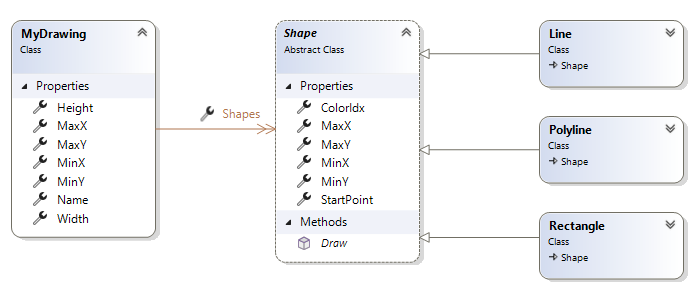

# X Viewer

## Lehrinhalte

- Parsen von 2D-Figuren aus `txt`-Dateien
- WPF `UserControl`, MVVM + Databinding

## Aufgabenstellung

Ein externes Grafikprogramm (proprietär) speichert Zeichnungen in einer Textdatei. Das gesuchte Programm soll diese Zeichnungen (=Dateien) lesen und in einer Vorschau anzeigen können. 

### Format der Zeichnungsdatei

Eine Zeichnungsdatei enthält das folgende Objektmodell:



* **MyDrawing**  
  Entspricht der Datei.  
  Die Eigenschaft "Name" wird in unserem Beispiel mit dem Dateinamen (ohne Pfad) initialisiert.

* **Shape**  
  Eine Zeichnung enthält beliebig viele **Shapes**.  
  Ein *Shape* (abstrakte Klassen) enthält einen ColorIdx (mit welcher Farbe gezeichnet werden soll) und einen *StartPoint* (die Position des Shapes).  
  Die virtuellen, berechneten Properties MinX, MinY, ... können verwendet werden um für eine abgeleitete Klasse die Werte (die tatsächliche Breite, ...) zu ermitteln.  
  In unserer Datei ist in jeder Zeile ein einziges Shape gespeichert.

* **Line**, **Rectangle** und **Polyline**  
  Diese von **Shape** abgeleiteten Klassen definieren ein konkretes Zeichenobjekt.  
  Erweitern sie die Klassen um die entsprechenden Eigenschaften.

### Beispiel für eine Zeichendatei

```
Line;StartPoint=20.0,2.0;EndPoint=2.5,30.25;ColorIdx=2
Rectangle;ColorIdx=3;StartPoint=11.0,11.0;EndPoint=15.0,22.0
PolyLine;ColorIdx=3;StartPoint=100,100;Points=100,200,200,200,100,200,100,100
```

* Jede Zeile enthält *ein* Shape.
* Die Werte (Eigenschaften) eines Shapes werden durch das Zeichen ';' (Semikolon) getrennt.  
* Der erste Wert (die erste Spalte) muss einen gültigen Shape-Typnamen enthalten.  
  Aktuell: '*Line*', '*Rectangel*' oder '*PolyLine*'
* Alle weiteren Spalten haben das Format:  
    **Eigenschaften-Name**=**Eigenschaften-Wert**  
  Ist z.B. in einer *beliebigen* Spalte  `ColorIdx=1`,  wird damit der Wert für das Property **Shape.ColorIdx** definiert.  
  Die gültigen Properties hängen natürlich vom Shape (Line, Rectangle, LolyLine) ab.  
 Wird eine Position definiert (z.B. Shape.StartPoint), wird dieser mit zwei Gleitkommazahlen (CultureInfo.InvariantCulture), durch Beistrich getrennt, angegeben. 
* Bei einer Punkt-Liste (z.B. Polyline) werden die X und Y Werte wiederholt:  
  Beispiel: `Points=100,200,200,200,100,200,100,100` (enthält 4 Punkte: 100:200, 200:200, 100:200 und 100:100)

## Task 1: Importieren der Zeichnungsdatei

Implementieren Sie die Methode (in der Klasse `DrawingParser`)

```csharp
public static async Task<MyDrawing> ParseDrawingAsync(string fileName)
```

Die asynchrone Methode liest die Datei und erstellt daraus eine Instanz der Klasse `MyDrawing`. Das Property `Shapes` enthält alle Zeichenobjekte.

## Task 2: Anzeige Zeichnungen in einem Wpf Programm


* Das Fenster teilt sich in 3 Bereiche:  
  * Überschriftszeile (oben): fixer Text "X Viewer"
  * Auswahl (Liste), Steuerung (links)
  * Vorschau Zeichnung
* Im Bereich "Steuerung" ist eine Liste (dynamische Höhe) enthalten.  Nachdem der Anwender eine neue Zeichnung - mit dem Button "Load drawing file ..." - geladen hat, wird diese in die Liste aufgenommen.  
* Die Vorschau der Zeichnung wird geändert, wenn der Anwender in der Liste eine neue Zeichnung selektiert.
* Eine Zeichnung kann aus der Liste mit dem Button "Delete" (nur aktiv, wenn eine Zeichnung ausgewählt ist) gelöscht werden. Das Entfernen MUSS mit einer MessageBox bestätigt werden. 
* Achten Sie auf dynamische Größen (Vorschau und Liste)
* Der Button "Load drawing file ..." zeigt für die Auswahl der Zeichendatei einen "OpenFileDialog" an.